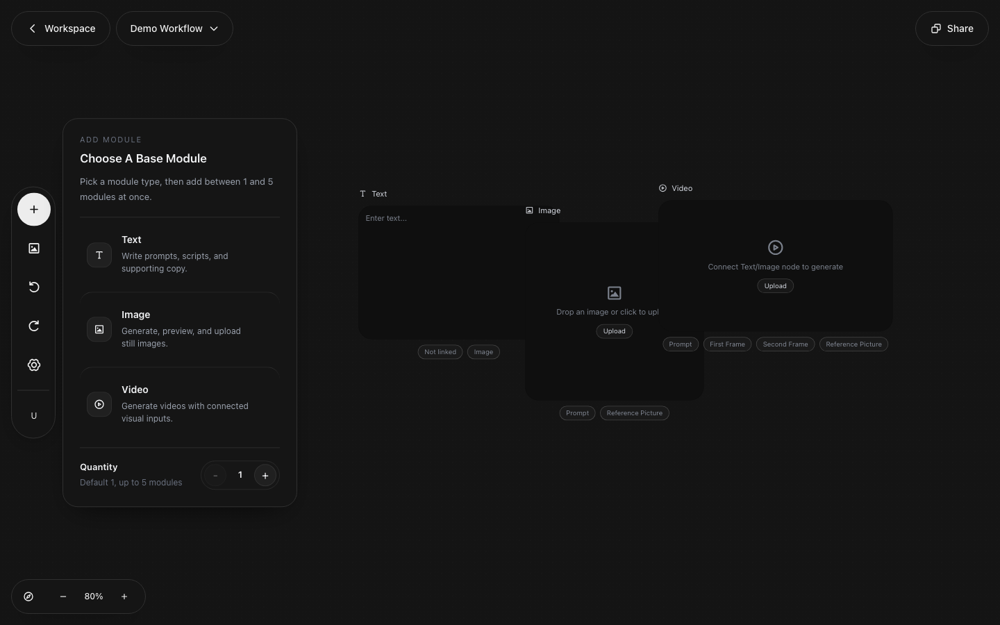
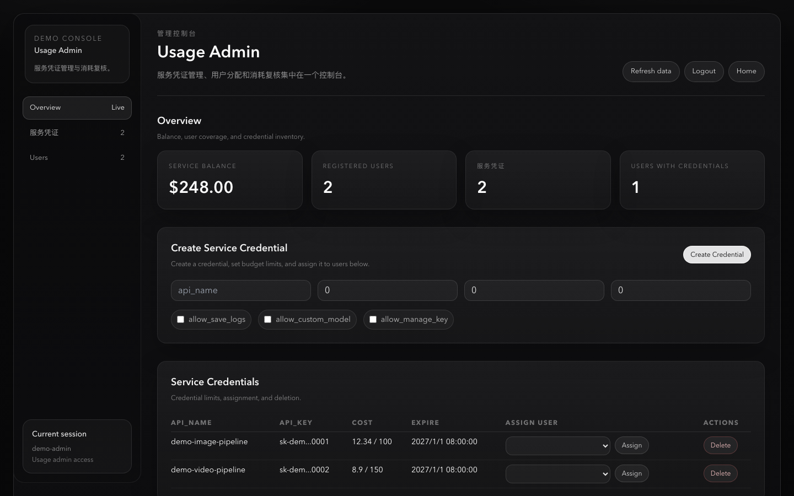

# Eager Canvas

Eager Canvas is a visual workflow workspace for AI-assisted image, video, and media operations. It combines an infinite canvas, modular nodes, project persistence, usage tracking, and admin tools in one full-stack repository.

This README is written for public GitHub presentation. Screenshots use sanitized demo text and mock data only; they do not contain production users, customer material, API keys, invoices, or real business workflows.

## Screenshots

### Home


### Canvas Workflow



### Admin Console



## What It Does

| Area | Capability |
| --- | --- |
| Visual canvas | Infinite canvas with zoom, pan, drag, node grouping, custom edges, history, and fit-to-view controls |
| Workflow nodes | Text, image, video, and configuration nodes for building reusable media pipelines |
| Tool flows | Side-panel tools for common production tasks, including reference-driven generation and batch-style workflows |
| Project workspace | Recent projects, project duplication, shared workspace templates, and project-level persistence |
| Media handling | Upload, preview, persisted media references, and recovery paths for missing local previews |
| Usage tracking | User-level usage summaries, run records, cost metadata, and reconciliation support |
| Admin tools | Role-aware admin pages for users, service access, credential assignment, usage review, and audit-oriented operations |
| Backend API | Express API for auth, projects, runs, uploads, workspace sharing, usage, and admin services |

## Tech Stack

| Layer | Stack |
| --- | --- |
| Frontend | Vue 3, Vite, Vue Router, Vue Flow, Naive UI, Tailwind CSS |
| Backend | Node.js, Express, JWT auth, service adapters |
| Data | Supabase Postgres and Supabase Storage |
| Tooling | ESLint, Node test runner, Vite build, Vercel-compatible config |

## Project Structure

| Path | Purpose |
| --- | --- |
| `src/` | Frontend app: home, canvas, workspace, usage, admin, nodes, tools, stores, and API clients |
| `backend/` | Express API: auth, project persistence, usage, admin, upload, workspace, and provider services |
| `supabase/` | Database initialization and incremental migrations |
| `docs/` | Product notes, technical planning docs, and README-safe screenshots |
| `README.docker.md` | Static frontend container deployment notes |

## Main Routes

| Route | Purpose |
| --- | --- |
| `/` | Public home screen and account entry |
| `/canvas/:id?` | Main canvas and node workflow editor |
| `/workspace` | Project workspace and shared templates |
| `/usage` | Current user usage dashboard |
| `/admin/*` | Role-aware internal admin surfaces |
| `/usage-admin` | Separate operational usage console |

## Local Development

Install dependencies:

```bash
npm install
npm --prefix backend install
```

Create frontend environment config from `.env.example`:

```bash
VITE_APP_API_BASE_URL=/api/v1
VITE_BYPASS_AUTH=false
```

Create backend environment config from `backend/.env.example`, then provide your Supabase, auth, email, and provider credentials locally. The backend reads `backend/.env.local` before `backend/.env`, while shell/Vercel-provided environment variables keep highest priority. Do not commit real `.env` files or production screenshots.

For final validation environment handoff, use `docs/FINAL_VALIDATION_ENV.md`. It lists the exact local files and required keys without exposing secret values.

Initialize the database by applying the SQL files in `supabase/` in filename order.

Start the backend:

```bash
npm --prefix backend run dev
```

Start the frontend:

```bash
npm run dev
```

The default frontend URL is `http://localhost:5173`; the backend defaults to `http://localhost:8787`.

## Preview Mode

For UI-only local screenshots or design review, you can run the frontend with auth bypass in dev mode:

```bash
VITE_BYPASS_AUTH=true npm run dev
```

Preview mode is useful for navigation and visual checks, but it is not a replacement for full backend, Supabase, auth, persistence, and usage verification.

## Verification

Run the main local checks before merging or deploying:

```bash
npm run check
npm run build
npm run check:validation-readiness
```

For final local validation setup, `npm run prepare:validation-env` creates ignored `.env.local` skeleton files with non-secret defaults and placeholder secrets. `npm run generate:validation-jwt-secrets` fills local JWT secrets without printing their values.
`npm run show:final-validation-runbook` prints the current readiness blockers and the final validation steps without exposing env values.

`npm run check` runs frontend linting, maintenance checks, frontend tests, and backend service tests. For backend-only iteration, run `npm run test:backend`.

## Deployment

The repository includes Vercel-compatible frontend and backend config. The static frontend Docker path is documented separately in [README.docker.md](README.docker.md).

Before publishing a public README update, review screenshots and copy for sensitive content:

- Use demo project names and placeholder prompts.
- Use `example.test` emails or synthetic users.
- Use masked or fake service keys only.
- Avoid customer names, production assets, real balances, private workflow prompts, and provider secrets.
