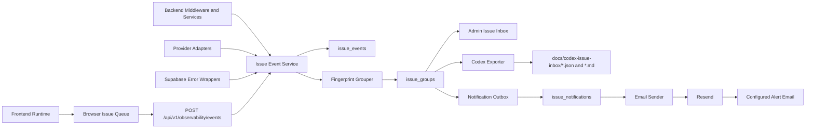

# Eager Canvas Issue Observability PRD

> 文档状态：V1 开发 PRD
> 文档目的：定义 Eager Canvas 内置线上问题采集、聚合、Codex 修复信息表导出和邮件通知能力。
> 核心原则：线上链路只做低成本、脱敏、异步的证据采集；问题归类以规则和指纹为主；Codex 读取结构化问题表后再执行修复。
> 更新时间：2026-06-06

---

## 1. 背景

Eager Canvas 目前已经具备前端错误边界、统一 HTTP 请求层、后端统一错误中间件、Supabase 数据层、后台管理页、审计日志、用量日志和 Resend 邮件能力。这些基础能覆盖用户登录、画布、模型调用、用量统计和后台管理，但还缺少一个面向线上问题修复的统一证据管道。

当前线上问题通常来自以下来源：

1. 前端运行时错误，例如 Vue 组件异常、异步 promise 未处理、路由加载失败、白屏 fallback。
2. 前端 API 错误，例如生成、上传、保存、轮询等接口失败或超时。
3. 后端服务错误，例如 Express 500、鉴权失败、上传失败、run 状态同步失败。
4. 数据库错误，例如 Supabase 查询失败、约束不一致、迁移与线上 schema 漂移。
5. 模型供应商错误，例如 302.ai / derouter / OpenAI-compatible provider 返回异常、异步任务状态和资产解析不一致、usage 或 billing 缺失。
6. 性能和交互问题，例如慢 API、长任务、重复失败操作、生成任务长时间未完成。

这些问题如果只靠用户截图或后台零散日志，很难快速判断根因属于前端、后端、数据库还是模型供应商。Codex 在修复时也缺少统一的证据入口，经常需要重新追踪 request、run、provider 和页面状态。

本 PRD 的目标是建设一个轻量的 Issue Observability 系统，把线上问题整理成 Codex 可以直接识别和处理的信息表。

---

## 2. 一句话定义

Issue Observability 是 Eager Canvas 内置的线上问题证据收集和修复交接系统。它通过事件驱动方式采集前端、后端、数据库、模型供应商和性能问题，按 fingerprint 聚合成 issue group，并导出 Codex JSON / Markdown 信息表，同时在高优先级问题出现时发送脱敏邮件通知。

---

## 3. 当前项目基础

### 3.1 可复用前端基础

1. `src/components/ui/ErrorBoundary.vue` 已作为根级错误边界接入 `App.vue`，可以作为前端组件错误采集入口。
2. `src/utils/request.js` 是 axios 统一请求层，可以采集 API 失败、状态码、requestId、耗时和静默错误标记。
3. `src/utils/appVersion.js` 已有 build id / build time 概念，可以把 issue 关联到发布版本。
4. `src/router/index.js` 统一路由守卫和 route name，可以把 issue 关联到业务页面。

### 3.2 可复用后端基础

1. `backend/src/app.js` 已为每个请求生成 `x-request-id`，适合作为前后端证据串联主键。
2. `backend/src/middleware/error.js` 是 Express 统一错误出口，可以采集 500、业务错误 code 和 stack 摘要。
3. `backend/src/services/runs.service.js`、`provider.service.js`、`providers/**` 已承载模型调用、轮询、资产提取和 usage 写入链路，是 provider issue 的核心证据来源。
4. `backend/src/services/admin-operation-logs.js` 已有后台日志查询和 fallback 模式，可借鉴但不应复用为高频 issue 明细表。
5. `backend/src/services/email.service.js` 已接入 Resend，可扩展 issue alert 邮件发送能力。

### 3.3 可复用数据基础

1. Supabase 已有 `usage_events`、`audit_logs`、`admin_operation_logs` 等表。
2. 历史分析显示 `usage_events.raw_usage` 曾出现大 JSON 膨胀风险，因此 issue 系统必须单独建表，并强制摘要化、截断、脱敏和保留期。
3. 新建表必须启用 RLS，默认只允许后端 service role 写入和 admin API 读取，不允许前端直接通过 Data API 访问。

---

## 4. 目标

### 4.1 产品目标

1. 自动收集线上版本中真实发生的问题。
2. 将同类问题按 fingerprint 聚合，避免重复噪音。
3. 将前端、后端、数据库、模型供应商和性能证据串成同一条 trace。
4. 在后台提供 Issue Inbox，按优先级、影响用户数、时间窗口和来源筛选。
5. 导出 Codex 可读的 JSON / Markdown 信息表，使 Codex 能快速判断问题来源和修复路径。
6. 高优先级问题自动发送邮件到配置的接收人，例如 `wh896794@gmail.com`。
7. 确保采集和导出能力不影响前端项目运行和性能。

### 4.2 技术目标

1. 前端采集必须 best-effort，不阻塞用户交互。
2. 后端采集必须 best-effort，不改变 API 原响应。
3. 问题归类用确定性规则，不在实时采集层引入文字模型。
4. 文字模型仅作为后续可选的异步摘要能力，不参与线上采集链路。
5. 原始事件和聚合问题分表存储，避免高频写入污染业务表。
6. 邮件通知使用 outbox 模式，发送失败不能影响线上请求。
7. 所有导出和邮件内容必须脱敏。

### 4.3 业务目标

1. 减少线上问题定位时间。
2. 让 Codex 修复基于证据而不是猜测。
3. 将用户反馈、运行时错误、provider 异常和数据库异常放入同一个修复队列。
4. 为后续自动生成修复任务、GitHub issue 或 Codex thread 打基础。

---

## 5. 非目标

V1 不做以下内容：

1. 不自动修改线上代码。
2. 不让线上服务直接调用 Codex 修复。
3. 不在前端采集完整 prompt、图片、视频、canvas_json、localStorage、cookie、token、API key。
4. 不采集所有成功请求明细。
5. 不把 `issue_events` 写入 `usage_events.raw_usage`。
6. 不把文字模型放入实时采集链路。
7. 不建设完整 APM 系统或替代 Sentry / Datadog。
8. 不实现复杂告警平台，只实现邮件通知和后台 Issue Inbox。
9. 不在 V1 实现 GitHub issue 自动创建或 PR 自动生成。

---

## 6. 总体架构



### 6.1 核心链路

1. 前端或后端产生 issue event。
2. 后端接收并标准化 event。
3. 服务端根据来源和字段计算 fingerprint。
4. 原始摘要写入 `issue_events`。
5. 同步或异步 upsert `issue_groups`。
6. 根据 severity、影响范围和冷却时间判断是否创建 `issue_notifications`。
7. 邮件发送 worker 异步发送通知。
8. 管理员在 Issue Inbox 查看、筛选、导出。
9. Codex 读取导出的 JSON / Markdown 信息表修复问题。

---

## 7. 信息收集维度

### 7.1 主分类维度：问题指纹

系统不以时间或 user_id 作为主分类，而以 `fingerprint` 作为问题归类主键。

原因：

1. 同一个问题可能影响多个用户，按用户分类会把同一 bug 打散。
2. 同一个用户可能触发多个问题，按用户分类会混淆根因。
3. Codex 修复需要的是“可修复的问题单”，不是用户行为流水。

### 7.2 辅助排序维度：时间窗口

时间用于判断新问题、回归和突增。

V1 固定统计以下窗口：

| 时间窗口 | 用途 |
| --- | --- |
| 最近 15 分钟 | 判断突发高优先级问题 |
| 最近 1 小时 | 判断短期集中问题 |
| 最近 24 小时 | 生成日常 Codex 修复列表 |
| 当前 build 发布后 | 判断是否由当前版本引入 |

### 7.3 辅助定位维度：用户和 session

用户维度用于判断影响范围，不作为主分类。

记录策略：

1. `user_id` 仅后端内部可见。
2. 导出给 Codex 时默认使用 `user_hash`。
3. 邮件通知不列出完整用户邮箱。
4. 后台 Issue Inbox 可在 admin 权限下查看用户影响数量和必要的内部定位字段。

### 7.4 辅助定位维度：requestId / traceId

`requestId` 是前后端证据链的关键字段。

典型链路：

```text
frontend api_error
-> requestId=req_123
-> backend provider_error
-> provider task_result
-> issue_group
```

Codex 看到同一个 requestId 串联的证据后，可以快速判断根因在前端、后端、数据库或供应商适配层。

---

## 8. 采集频率和触发方式

### 8.1 前端采集

前端不做固定频率全量扫描，只做事件驱动采集。

| 事件类型 | 触发方式 | 采集规则 |
| --- | --- | --- |
| Vue component error | `ErrorBoundary` 捕获 | 立即进入本地队列 |
| global runtime error | `window.onerror` | 立即进入本地队列 |
| unhandled rejection | `window.unhandledrejection` | 立即进入本地队列 |
| API error | axios response interceptor | 非静默错误进入队列 |
| API timeout | axios error code / message | 超时进入队列 |
| slow API | request duration | 超过 2000ms 进入队列 |
| long task | PerformanceObserver | 超过 200ms 进入队列 |
| route load failure | router error / dynamic import error | 立即进入队列 |
| user feedback | 用户手动提交 | 立即进入队列 |

前端 flush 策略：

1. 队列满 10 条发送一次。
2. 每 30 秒最多发送一次。
3. 页面隐藏或卸载时用 `sendBeacon` flush 一次。
4. 每个 session 最多上报 50 条。
5. 同一 fingerprint 每 5 分钟最多上报 3 条。
6. 上报接口返回 429 或连续失败 3 次后，本 session 停止上报。

### 8.2 后端采集

后端不记录所有成功请求明细，只记录错误、慢请求和关键异常。

| 事件类型 | 触发方式 | 采集规则 |
| --- | --- | --- |
| server error | `errorMiddleware` | status >= 500 记录 |
| business error | HttpError | P1/P2 code 白名单记录 |
| slow request | request observer | duration >= 3000ms 记录 |
| provider error | provider adapter | upstream error 或 result mismatch 记录 |
| DB error | Supabase query wrapper | query error 记录摘要 |
| run inconsistency | runs service | completed without asset、usage missing、polling stuck 记录 |
| upload failure | upload service | bucket limit、storage error、remote fetch error 记录 |

后端写入策略：

1. issue 写入失败只记录 server console warning，不影响原响应。
2. serverless 环境使用后台生命周期保护，避免响应后异步写入被中断。
3. 对同一 requestId 的事件允许短时间内补充，最终由 issue group 聚合。

### 8.3 聚合频率

V1 支持两种方式：

1. 事件写入时同步 upsert `issue_groups`，保证后台列表及时可见。
2. 每 5 分钟运行一次轻量聚合任务，修正 affected_users、last_seen、窗口计数和 notification 状态。

推荐默认同时使用：

```text
写入时快速 upsert
+ 5 分钟周期性 reconcile
```

---

## 9. 数据模型

### 9.1 `issue_events`

用途：保存脱敏后的原始事件摘要。

建议字段：

```sql
create table public.issue_events (
  id uuid primary key default gen_random_uuid(),
  created_at timestamptz not null default now(),
  source_layer text not null,
  category text not null,
  severity text not null,
  environment text not null,
  build_id text,
  release_commit text,
  user_id uuid,
  session_hash text,
  request_id text,
  trace_id text,
  route text,
  route_name text,
  component text,
  method text,
  path_template text,
  status_code integer,
  duration_ms integer,
  provider text,
  model text,
  upstream_endpoint text,
  upstream_status integer,
  db_table text,
  db_operation text,
  db_code text,
  error_code text,
  message_summary text,
  stack_summary text,
  fingerprint text not null,
  metadata jsonb not null default '{}'::jsonb
);
```

索引：

```sql
create index idx_issue_events_fingerprint_created_at
  on public.issue_events(fingerprint, created_at desc);

create index idx_issue_events_created_at
  on public.issue_events(created_at desc);

create index idx_issue_events_source_category_created_at
  on public.issue_events(source_layer, category, created_at desc);

create index idx_issue_events_request_id
  on public.issue_events(request_id)
  where request_id is not null;

create index idx_issue_events_user_created_at
  on public.issue_events(user_id, created_at desc)
  where user_id is not null;
```

### 9.2 `issue_groups`

用途：保存按 fingerprint 聚合后的问题单。

建议字段：

```sql
create table public.issue_groups (
  id uuid primary key default gen_random_uuid(),
  created_at timestamptz not null default now(),
  updated_at timestamptz not null default now(),
  first_seen_at timestamptz not null,
  last_seen_at timestamptz not null,
  fingerprint text not null unique,
  source_layer text not null,
  category text not null,
  severity text not null,
  status text not null default 'open',
  title text not null,
  event_count integer not null default 0,
  affected_users integer not null default 0,
  affected_sessions integer not null default 0,
  affected_routes integer not null default 0,
  affected_builds integer not null default 0,
  latest_build_id text,
  latest_release_commit text,
  latest_request_id text,
  sample_event_ids uuid[] not null default '{}',
  root_cause_layer text,
  root_cause_confidence text not null default 'unknown',
  evidence_summary jsonb not null default '{}'::jsonb,
  codex_handoff jsonb not null default '{}'::jsonb,
  last_notified_at timestamptz,
  notification_count integer not null default 0
);
```

索引：

```sql
create index idx_issue_groups_status_severity_last_seen
  on public.issue_groups(status, severity, last_seen_at desc);

create index idx_issue_groups_source_category_last_seen
  on public.issue_groups(source_layer, category, last_seen_at desc);
```

### 9.3 `issue_notifications`

用途：保存邮件通知 outbox，避免发送失败影响用户请求。

建议字段：

```sql
create table public.issue_notifications (
  id uuid primary key default gen_random_uuid(),
  created_at timestamptz not null default now(),
  updated_at timestamptz not null default now(),
  issue_group_id uuid not null references public.issue_groups(id) on delete cascade,
  channel text not null default 'email',
  recipient text not null,
  status text not null default 'queued',
  reason text,
  payload jsonb not null default '{}'::jsonb,
  attempts integer not null default 0,
  next_retry_at timestamptz,
  resend_message_id text,
  sent_at timestamptz,
  failed_at timestamptz,
  error_message text
);
```

索引：

```sql
create index idx_issue_notifications_status_next_retry
  on public.issue_notifications(status, next_retry_at, created_at);

create index idx_issue_notifications_issue_group_created_at
  on public.issue_notifications(issue_group_id, created_at desc);
```

### 9.4 RLS 和 Data API

1. 三张表全部启用 RLS。
2. 前端不直接访问三张表。
3. 后端使用 service role 写入。
4. Admin API 读取时通过 Express 权限控制。
5. 如果 Supabase Data API 默认暴露新表，也不授予 anon / authenticated 直接访问权限。

---

## 10. 标准事件协议

### 10.1 前端上报 payload

```json
{
  "source_layer": "frontend",
  "category": "api_error",
  "severity": "p2",
  "build_id": "20260606-abc123",
  "route": "/canvas/123",
  "route_name": "Canvas",
  "component": "ImageNode",
  "request_id": "req_123",
  "method": "POST",
  "path_template": "/api/v1/images/generations",
  "status_code": 502,
  "duration_ms": 180000,
  "error_code": "PROVIDER_ERROR",
  "message_summary": "Image generation failed",
  "stack_summary": "ImageNode.vue -> useImageNodeGeneration.js",
  "metadata": {
    "node_type": "image",
    "operation": "generate",
    "model": "gpt-image-2",
    "silent_error_toast": false
  }
}
```

### 10.2 后端内部事件 payload

```json
{
  "source_layer": "provider",
  "category": "provider_error",
  "severity": "p1",
  "request_id": "req_123",
  "user_id": "00000000-0000-0000-0000-000000000000",
  "method": "POST",
  "path_template": "/api/v1/images/generations",
  "provider": "302ai",
  "model": "gpt-image-2",
  "upstream_endpoint": "/ws/api/v3/google/gemini-3-pro-image/text-to-image",
  "upstream_status": 200,
  "error_code": "COMPLETED_WITHOUT_ASSET",
  "message_summary": "Provider task completed but no image asset was extracted",
  "metadata": {
    "run_id": "run_123",
    "task_id_hash": "sha256:...",
    "provider_request_id_hash": "sha256:...",
    "fallback_used": false
  }
}
```

### 10.3 字段限制

1. `message_summary` 最大 500 字符。
2. `stack_summary` 最大 2000 字符，只保留前 5 个有效 frame。
3. `metadata` 序列化后最大 16KB。
4. 超限字段必须截断并标记 `_truncated: true`。
5. base64、data URL、完整 prompt、完整 canvas_json、cookies、Authorization、API key 必须剔除。

---

## 11. Fingerprint 规则

### 11.1 前端运行时错误

```text
build_id + route_name + component + error_name + top_stack_frames
```

### 11.2 前端 API 错误

```text
method + path_template + status_code + error_code + route_name
```

### 11.3 后端错误

```text
method + path_template + status_code + error_code + top_backend_stack
```

### 11.4 数据库错误

```text
db_operation + db_table + db_code + constraint_or_message_bucket
```

### 11.5 模型供应商错误

```text
provider + model + operation + upstream_endpoint_template + upstream_status + normalized_provider_code
```

### 11.6 性能问题

```text
route_name + metric_name + threshold_bucket + build_id
```

### 11.7 用户反馈

```text
route_name + feedback_category + action_name
```

### 11.8 归一化要求

1. URL 中的 UUID、taskId、projectId、runId 必须替换为占位符。
2. 数字时间戳、随机 token、hash、签名 URL 必须替换为占位符。
3. provider message 只保留稳定错误码或归一化后的错误类别。
4. fingerprint 生成结果使用 SHA-256。

---

## 12. 根因定位规则

### 12.1 root cause layer

`issue_groups.root_cause_layer` 可取值：

1. `frontend`
2. `backend`
3. `database`
4. `provider`
5. `performance`
6. `ux`
7. `unknown`

### 12.2 置信度

`root_cause_confidence` 可取值：

1. `high`
2. `medium`
3. `low`
4. `unknown`

### 12.3 判定规则

| 证据 | root_cause_layer | confidence |
| --- | --- | --- |
| 前端 error 无 requestId，stack 指向 Vue/component | frontend | high |
| 前端 API error 有 requestId，后端同 requestId 有 500 | backend | high |
| 后端同 requestId 有 Supabase pg code / table / constraint | database | high |
| 后端同 requestId 有 provider / model / upstream code | provider | high |
| provider 返回成功但 run asset / usage 缺失 | provider 或 backend | medium |
| 只有慢请求，无明确错误 | performance | medium |
| 用户反馈无技术事件 | ux | low |
| 多层证据冲突 | unknown | low |

### 12.4 Codex 修复提示规则

Codex handoff 只输出 evidence 和 hints，不输出未经证据支持的结论。

允许：

```text
Evidence shows provider task completed but asset extraction returned empty.
Suspected files: backend/src/services/providers/image-response.js, backend/src/services/runs.service.js.
```

不允许：

```text
The parser is definitely broken.
```

---

## 13. Codex 信息表

### 13.1 导出目标

导出文件路径：

```text
docs/codex-issue-inbox/YYYY-MM-DD-issues.md
docs/codex-issue-inbox/YYYY-MM-DD-issues.json
```

单个 issue 也可以导出：

```text
docs/codex-issue-inbox/ISS-20260606-003.md
docs/codex-issue-inbox/ISS-20260606-003.json
```

### 13.2 Markdown 表结构

```md
| Priority | Source | Issue ID | Title | Impact | Evidence | Root-Cause Signal | Suspected Files | Repro | Validation |
| --- | --- | --- | --- | --- | --- | --- | --- | --- | --- |
| P1 | provider | ISS-20260606-003 | gpt-image task completed without asset | 42 events, 8 users | requestId=req_123, model=gpt-image-2 | provider completed, asset extraction empty | backend/src/services/provider.service.js | Run image generation | npm run test:backend && npm run check |
```

### 13.3 JSON schema

```json
{
  "schema_version": "codex_issue_table/v1",
  "generated_at": "2026-06-06T00:00:00.000Z",
  "repo": {
    "root": "/Users/hale/Documents/Eager DEV/Eager Canvas/repo",
    "branch": "main",
    "commit": "abc123",
    "build_id": "20260606-abc123"
  },
  "filters": {
    "from": "2026-06-05T00:00:00.000Z",
    "to": "2026-06-06T00:00:00.000Z",
    "min_severity": "p2",
    "status": "open"
  },
  "issues": [
    {
      "id": "ISS-20260606-003",
      "priority": "P1",
      "source_layer": "provider",
      "category": "provider_error",
      "fingerprint": "sha256:...",
      "title": "gpt-image task completed without asset",
      "status": "open",
      "confidence": "high",
      "impact": {
        "events": 42,
        "affected_users": 8,
        "affected_sessions": 10,
        "first_seen": "2026-06-06T01:00:00.000Z",
        "last_seen": "2026-06-06T02:00:00.000Z"
      },
      "evidence": {
        "routes": ["/canvas/:id"],
        "api_paths": ["/api/v1/images/generations"],
        "request_ids": ["req_123"],
        "provider": "302ai",
        "model": "gpt-image-2",
        "upstream_status": 200,
        "normalized_error": "completed_without_asset"
      },
      "root_cause_hints": [
        "Frontend requestId matches backend provider event.",
        "Provider returned completed state but no asset was extracted."
      ],
      "suspected_files": [
        "backend/src/services/provider.service.js",
        "backend/src/services/runs.service.js",
        "backend/src/services/providers/image-response.js"
      ],
      "reproduction": {
        "steps": [
          "Open a canvas project.",
          "Run image generation with model gpt-image-2.",
          "Poll the generated task until provider returns completed."
        ],
        "requires_live_provider": true
      },
      "validation": {
        "commands": [
          "npm run test:backend",
          "npm run check"
        ],
        "browser_smoke": [
          "/canvas/new with VITE_BYPASS_AUTH=true"
        ]
      },
      "redaction": {
        "prompt_omitted": true,
        "media_omitted": true,
        "user_exported_as_hash": true
      }
    }
  ]
}
```

### 13.4 Codex 可识别要求

每个 issue 必须包含：

1. `id`
2. `priority`
3. `source_layer`
4. `category`
5. `fingerprint`
6. `title`
7. `impact`
8. `evidence`
9. `root_cause_hints`
10. `suspected_files`
11. `reproduction`
12. `validation`
13. `redaction`

如果某字段证据不足，必须给空数组或 `unknown`，不能编造。

---

## 14. 邮件通知

### 14.1 目标

当后台检测到高优先级问题并完成短窗口证据收集后，自动打包摘要并发送邮件到配置收件人。

默认接收人可以配置为：

```text
ISSUE_ALERT_EMAILS=wh896794@gmail.com
```

### 14.2 环境变量

```text
ISSUE_ALERT_ENABLED=true
ISSUE_ALERT_EMAILS=wh896794@gmail.com
ISSUE_ALERT_MIN_SEVERITY=p2
ISSUE_ALERT_COOLDOWN_MINUTES=360
ISSUE_ALERT_EVIDENCE_DELAY_SECONDS=60
ISSUE_ALERT_MAX_PER_HOUR=10
```

邮件发送依赖已有 Resend 配置：

```text
RESEND_API_KEY=
RESEND_FROM_EMAIL=
```

### 14.3 触发规则

| 问题等级 | 触发条件 | 邮件策略 |
| --- | --- | --- |
| P0 | 单次事件成立 | 延迟 30-60 秒收集证据后发送 |
| P1 | 单次事件成立 | 延迟 30-60 秒收集证据后发送 |
| P2 | 10 分钟内 >= 3 次或影响 >= 2 个用户 | 发送 |
| P3 | 默认不发送 | 仅进后台和日报 |

去重和冷却：

1. 同一 `issue_group` 在冷却期内不重复发送。
2. severity 升级可以突破冷却。
3. affected_users 增长超过 3 倍可以突破冷却。
4. 每小时最多发送 `ISSUE_ALERT_MAX_PER_HOUR` 封。

### 14.4 邮件主题

```text
[P1][provider] Eager Canvas issue ISS-20260606-003: gpt-image task completed without asset
```

### 14.5 邮件正文

```text
Issue: ISS-20260606-003
Priority: P1
Source: provider
Category: provider_error
First seen: 2026-06-06 09:00
Last seen: 2026-06-06 09:10
Events: 42
Affected users: 8
Build: 20260606-abc123

Evidence:
- Route: /canvas/:id
- API: POST /api/v1/images/generations
- Provider: 302ai
- Model: gpt-image-2
- Normalized error: completed_without_asset

Root-cause signal:
- Frontend requestId matches backend provider event.
- Provider returned completed state but no asset was extracted.

Suspected files:
- backend/src/services/provider.service.js
- backend/src/services/runs.service.js
- backend/src/services/providers/image-response.js

Codex package:
docs/codex-issue-inbox/ISS-20260606-003.json
```

### 14.6 发送失败策略

1. Resend 未配置时，通知状态记为 `skipped`，不影响 issue 采集。
2. Resend 返回错误时，通知状态记为 `failed`。
3. 失败后最多重试 3 次。
4. 重试间隔使用 5 分钟、15 分钟、60 分钟。
5. 永远不把邮件发送错误抛回用户请求。

---

## 15. 后台 Issue Inbox

### 15.1 路由和权限

新增后台路由：

```text
/admin/issues
```

新增权限：

```text
admin.issue.read
admin.issue.export
admin.issue.update
admin.issue.notify
```

角色默认分配：

| Role | 权限 |
| --- | --- |
| super_admin | 全部 issue 权限 |
| admin | read、export、update、notify |
| ops | read、export、notify |
| support | read |
| user | 无权限 |

### 15.2 列表字段

Issue Inbox 列表展示：

1. priority
2. source layer
3. category
4. title
5. status
6. event count
7. affected users
8. first seen
9. last seen
10. latest build
11. root cause confidence
12. notification status

### 15.3 详情页字段

详情页展示：

1. Evidence timeline
2. RequestId trace
3. Frontend events
4. Backend events
5. Database events
6. Provider events
7. Performance events
8. Codex handoff preview
9. Email notification history
10. Export actions

### 15.4 操作

1. 标记 open / investigating / resolved / ignored。
2. 触发 Codex JSON / Markdown 导出。
3. 手动发送或重发邮件。
4. 复制 issue JSON。
5. 查看脱敏 sample event。

---

## 16. API 设计

### 16.1 前端事件上报

```text
POST /api/v1/observability/events
```

鉴权：

1. 已登录用户使用 access token。
2. 未登录页面允许匿名上报，但必须严格限流，只接受 frontend runtime / route load 类问题。

请求体：

```json
{
  "events": []
}
```

响应：

```json
{
  "ok": true,
  "accepted": 3,
  "dropped": 1
}
```

### 16.2 Admin 列表

```text
GET /api/v1/admin/issues
```

查询参数：

```text
status=open
severity=p1,p2
source_layer=provider
from=2026-06-05T00:00:00.000Z
to=2026-06-06T00:00:00.000Z
page=1
limit=20
```

### 16.3 Admin 详情

```text
GET /api/v1/admin/issues/:issueGroupId
```

### 16.4 更新状态

```text
PATCH /api/v1/admin/issues/:issueGroupId
```

请求体：

```json
{
  "status": "investigating"
}
```

### 16.5 导出 Codex 包

```text
POST /api/v1/admin/issues/export
```

请求体：

```json
{
  "issueGroupIds": ["..."],
  "format": "both"
}
```

### 16.6 发送通知

```text
POST /api/v1/admin/issues/:issueGroupId/notify
```

---

## 17. 前端性能约束

### 17.1 上报队列

前端必须使用内存队列。

要求：

1. 不在用户交互链路中 await 上报。
2. 默认使用 `navigator.sendBeacon`。
3. `sendBeacon` 不可用时使用 `fetch` + `keepalive`。
4. 上报失败不弹 toast。
5. 本地开发环境默认关闭线上上报，除非显式开启。

### 17.2 采样和限流

```text
maxEventsPerSession = 50
maxEventsPerFlush = 10
flushIntervalMs = 30000
sameFingerprintLimitPerFiveMinutes = 3
slowApiThresholdMs = 2000
longTaskThresholdMs = 200
```

### 17.3 数据体积

1. 单条前端事件序列化后不超过 16KB。
2. 单次 flush 不超过 128KB。
3. 超出则丢弃 metadata，仅保留必要字段。

---

## 18. 隐私和安全

### 18.1 禁止采集

绝对禁止采集：

1. Authorization header
2. Cookie
3. refresh token
4. access token
5. API key
6. provider key
7. 完整 prompt
8. 图片 base64
9. 视频内容
10. canvas_json
11. localStorage 全量内容
12. 完整 signed URL

### 18.2 脱敏规则

1. 邮箱默认 hash，后台 admin 详情按权限查看。
2. taskId / providerRequestId 导出时 hash。
3. URL query 默认剔除。
4. message 中疑似 key / token 的片段替换为 `[redacted]`。
5. data URL 替换为 `[omitted data-url]`。

### 18.3 保留期

| 数据 | 保留期 |
| --- | --- |
| issue_events 明细 | 30 天 |
| issue_groups 聚合 | 180 天 |
| issue_notifications | 180 天 |
| codex export 文件 | 手动清理或跟随 docs 管理 |

---

## 19. 文字模型边界

V1 不需要文字模型参与采集和聚合。

规则层负责：

1. 采集。
2. 标准化。
3. fingerprint。
4. source_layer 分类。
5. 时间窗口统计。
6. affected_users 统计。
7. 邮件触发判断。
8. Codex JSON 基础生成。

后续可选文字模型能力：

1. 自动生成更自然的 issue title。
2. 总结 evidence 为可读描述。
3. 推荐 suspected_files。
4. 把用户反馈归类。

约束：

1. 只读脱敏后的 `issue_groups` 和 sample events。
2. 输出必须标记为 hypothesis。
3. 不能覆盖规则层 evidence。
4. 失败不影响导出和邮件通知。

---

## 20. 实现任务拆解

### Phase 0：PRD 和验证边界

目标：固化需求、数据协议、性能边界和验收方式。

交付：

1. `docs/ISSUE_OBSERVABILITY_PRD.md`
2. Codex JSON schema 示例。
3. 邮件通知触发规则。
4. 功能核验清单。

验收：

1. PRD 无未定义核心字段。
2. 每个功能都有落地文件路径和验收方式。
3. 不包含实时模型分析和自动修复承诺。

### Phase 1：数据表和后端基础服务

目标：建立 issue 表、标准化、fingerprint 和 group upsert。

文件：

1. `supabase/015_issue_observability.sql`
2. `backend/src/services/issue-events.service.js`
3. `backend/src/services/issue-fingerprint.js`
4. `backend/src/services/issue-redaction.js`
5. `backend/src/services/issue-events.service.test.js`
6. `backend/src/services/issue-fingerprint.test.js`
7. `backend/src/services/issue-redaction.test.js`

验收：

1. migration 包含 RLS、索引、权限说明。
2. metadata 超限会截断。
3. prompt、base64、token、API key 会被剔除。
4. 同类事件生成同一 fingerprint。
5. 不同 provider/model/error 生成不同 fingerprint。

### Phase 2：后端采集入口

目标：让后端错误、慢请求、DB 和 provider 异常能写入 issue 系统。

文件：

1. `backend/src/middleware/request-observer.js`
2. `backend/src/middleware/error.js`
3. `backend/src/routes/observability.routes.js`
4. `backend/src/routes/index.js`
5. `backend/src/services/provider.service.js`
6. `backend/src/services/providers/**`
7. `backend/src/services/runs.service.js`
8. `backend/src/services/upload.service.js`

验收：

1. 500 错误生成 backend issue event。
2. provider error 生成 provider issue event。
3. DB error 生成 database issue event。
4. 慢请求超过阈值生成 performance issue event。
5. issue 写入失败不改变原 API status/body。

### Phase 3：前端采集 SDK

目标：前端错误、API 失败、慢 API 和 long task 能进入后端 ingestion。

文件：

1. `src/observability/observabilityClient.js`
2. `src/observability/observabilityRedaction.js`
3. `src/observability/observabilityClient.test.js`
4. `src/components/ui/ErrorBoundary.vue`
5. `src/utils/request.js`
6. `src/main.js`
7. `src/router/index.js`

验收：

1. ErrorBoundary 捕获事件进入队列。
2. axios API error 进入队列，并携带 requestId。
3. slow API 超阈值进入队列。
4. long task 超阈值进入队列。
5. session 限流生效。
6. sendBeacon / keepalive 不阻塞页面。
7. 上报失败不弹 toast、不影响原请求。

### Phase 4：Issue Inbox 后台

目标：管理员可以查看、筛选、更新和导出 issue group。

文件：

1. `backend/src/routes/admin.routes.js`
2. `backend/src/services/admin-issues.service.js`
3. `backend/src/services/admin-issues.service.test.js`
4. `src/api/admin.js`
5. `src/views/AdminUsers.vue`
6. `src/hooks/useAdminAccessState.js`
7. `src/hooks/useAdminDashboardSectionProps.js`
8. `src/components/admin/features/AdminIssueInboxSection.vue`
9. `src/components/admin/features/AdminIssueRow.vue`
10. `src/utils/adminDisplay.js`

验收：

1. `/admin/issues` 路由可访问。
2. 权限不足时不可查看 issue。
3. 可按 source、severity、status、时间筛选。
4. 可查看 issue detail。
5. 可更新 status。
6. 可触发 Codex 导出。

### Phase 5：Codex 导出

目标：生成稳定的 Markdown 和 JSON 信息表。

文件：

1. `backend/src/services/issue-codex-export.service.js`
2. `backend/src/services/issue-codex-export.service.test.js`
3. `scripts/export-codex-issues.mjs`
4. `scripts/export-codex-issues-core.mjs`
5. `scripts/export-codex-issues-core.test.mjs`
6. `docs/codex-issue-inbox/.gitkeep`

验收：

1. JSON 包含 `schema_version=codex_issue_table/v1`。
2. Markdown 表包含 Priority、Source、Issue ID、Impact、Evidence、Suspected Files、Validation。
3. 导出不包含完整 prompt、media、token、API key。
4. 无证据字段输出空数组或 `unknown`。
5. Codex 可以根据 JSON 判断 source_layer 和 suspected_files。

### Phase 6：邮件通知

目标：高优先级 issue group 成立或升级后，异步发送邮件。

文件：

1. `backend/src/services/issue-notification.service.js`
2. `backend/src/services/issue-notification.service.test.js`
3. `backend/src/services/email.service.js`
4. `backend/src/services/email.service.test.js`
5. `backend/src/config/env.js`
6. `backend/.env.example`
7. `docs/FINAL_VALIDATION_ENV.md`

验收：

1. P0/P1 单次成立后排队通知。
2. P2 满足阈值后排队通知。
3. P3 默认不排队通知。
4. 同一 issue group 冷却期内不重复发。
5. severity 升级可突破冷却。
6. Resend 未配置时 notification 标记 skipped。
7. Resend 失败时可重试，不影响用户请求。
8. 邮件内容脱敏，包含 Codex package 路径。

### Phase 7：清理和保留期任务

目标：控制数据体积，避免重复发生 raw JSON 膨胀。

文件：

1. `backend/src/services/issue-retention.service.js`
2. `backend/src/services/issue-retention.service.test.js`
3. `scripts/prune-issue-observability.mjs`
4. `scripts/prune-issue-observability-core.mjs`
5. `scripts/prune-issue-observability-core.test.mjs`

验收：

1. 可删除 30 天前 `issue_events` 明细。
2. 不删除仍 open 的 `issue_groups`。
3. 可清理 180 天前 notification。
4. 清理脚本 dry-run 输出数量，不输出敏感数据。

---

## 21. 验收清单

### 21.1 功能验收

| 项目 | 验收标准 |
| --- | --- |
| 前端错误采集 | ErrorBoundary 捕获后写入 issue_events |
| API 错误采集 | axios error 携带 requestId 写入 issue_events |
| 后端错误采集 | errorMiddleware 500 写入 issue_events |
| provider 错误采集 | provider/model/upstream_status 写入 issue_events |
| DB 错误采集 | db_table/db_operation/db_code 写入 issue_events |
| 性能采集 | slow API 和 long task 超阈值才写入 |
| fingerprint | 同类问题聚合到同一 issue_group |
| Issue Inbox | 管理员可筛选、查看、更新状态 |
| Codex 导出 | JSON 和 Markdown 文件可生成 |
| 邮件通知 | P1 issue group 可异步发送邮件 |

### 21.2 数据验收

| 项目 | 验收标准 |
| --- | --- |
| metadata 限制 | 单条事件不超过 16KB |
| 脱敏 | prompt、media、token、API key 不入库 |
| RLS | issue 表启用 RLS |
| 索引 | fingerprint、created_at、request_id、status/severity 有索引 |
| 保留期 | 明细和通知支持清理 |

### 21.3 性能验收

| 项目 | 验收标准 |
| --- | --- |
| 前端交互 | 上报不 await，不阻塞 UI |
| 上报频率 | 30 秒或 10 条 flush，session 限量 |
| 网络失败 | 上报失败不 toast，不影响业务请求 |
| 后端响应 | issue 写入失败不改变原 API 响应 |
| 构建体积 | 新增前端 SDK 不造成明显 bundle 膨胀 |

### 21.4 邮件验收

| 项目 | 验收标准 |
| --- | --- |
| 收件人配置 | `ISSUE_ALERT_EMAILS` 控制 |
| 冷却 | 同一 issue group 冷却期不重复 |
| 失败 | Resend 失败进入 failed，不影响请求 |
| 脱敏 | 邮件不含敏感字段 |
| Codex package | 邮件包含 issue id 和导出路径 |

### 21.5 Codex 修复验收

Codex 读取导出文件后，必须能够直接获得：

1. 问题优先级。
2. 来源层：frontend / backend / database / provider / performance / ux。
3. 影响范围。
4. 证据摘要。
5. requestId 或 trace 信息。
6. 可疑文件列表。
7. 复现步骤。
8. 建议验证命令。
9. 脱敏声明。

---

## 22. 验证命令

每个代码阶段完成后运行：

```bash
npm run check
npm run build
git diff --check
```

涉及后端服务时，至少运行：

```bash
npm run test:backend
```

涉及前端 SDK 或 Admin UI 时，至少运行：

```bash
npm run test:frontend
npm run build
```

涉及 scripts 时，至少运行：

```bash
npm run test:tools
```

涉及真实邮件发送时，需要在安全环境验证：

```text
RESEND_API_KEY=<resend api key>
RESEND_FROM_EMAIL=<verified sender>
ISSUE_ALERT_ENABLED=true
ISSUE_ALERT_EMAILS=wh896794@gmail.com
```

---

## 23. 风险和缓解

| 风险 | 影响 | 缓解 |
| --- | --- | --- |
| 高频事件导致数据库膨胀 | DB 成本和查询变慢 | 限流、采样、metadata 16KB、30 天保留期 |
| 邮件轰炸 | 管理员无法处理 | issue group 冷却、每小时上限、P3 不发 |
| 敏感信息泄露 | 安全风险 | 脱敏、禁止字段、hash、导出检查 |
| 误判根因 | Codex 修错方向 | evidence 和 hypothesis 分离，置信度标记 |
| 上报影响前端性能 | 用户体验下降 | sendBeacon、异步队列、session 限量 |
| 后端采集影响响应 | API 变慢或失败 | best-effort、outbox、错误吞掉 |
| RLS 或 Data API 暴露 | 数据泄露 | RLS、无 anon/auth direct grant、admin API 代理 |
| Resend 未配置 | 邮件不发送 | notification skipped，后台显示配置缺口 |

---

## 24. 实施顺序建议

推荐顺序：

1. Phase 1 数据表和服务基础。
2. Phase 2 后端采集。
3. Phase 3 前端 SDK。
4. Phase 5 Codex 导出。
5. Phase 6 邮件通知。
6. Phase 4 Admin Inbox。
7. Phase 7 保留期清理。

说明：

1. Codex 导出可以早于完整 Admin UI，实现更快收益。
2. 邮件通知应依赖 issue group，而不是原始 event。
3. Admin Inbox 可分阶段上线，先列表和导出，再详情 timeline。

---

## 25. PRD 功能核验

### 25.1 需求清晰度

| 检查项 | 结论 |
| --- | --- |
| 是否定义采集对象 | 已定义 frontend、backend、database、provider、performance、ux |
| 是否定义采集频率 | 已定义事件驱动、前端 flush、后端采集、5 分钟聚合 |
| 是否定义主分类方式 | 已定义 fingerprint 为主分类 |
| 是否定义用户维度用途 | 已定义用户作为影响范围和定位辅助 |
| 是否定义 Codex 信息表 | 已定义 Markdown 和 JSON schema |
| 是否定义邮件通知 | 已定义触发、冷却、环境变量、失败策略 |
| 是否定义性能边界 | 已定义异步队列、限流、大小限制 |
| 是否定义隐私边界 | 已定义禁止采集和脱敏规则 |

### 25.2 可落地性

| 检查项 | 结论 |
| --- | --- |
| 是否有现成前端接入口 | 有，ErrorBoundary、request.js、router、appVersion |
| 是否有现成后端接入口 | 有，app.js requestId、errorMiddleware、provider/runs services |
| 是否有邮件基础 | 有，Resend 和 email.service.js |
| 是否有后台基础 | 有，Admin Dashboard section 结构和 RBAC |
| 是否有验证命令 | 有，npm run check、build、backend/frontend/tools tests |
| 是否避免影响线上性能 | 有，best-effort、sendBeacon、outbox、限流 |

### 25.3 范围控制

| 检查项 | 结论 |
| --- | --- |
| 是否避免自动修复 | 是 |
| 是否避免实时文字模型依赖 | 是 |
| 是否避免全量用户行为采集 | 是 |
| 是否避免复用 raw_usage | 是 |
| 是否避免每事件发邮件 | 是，以 issue group 为邮件单位 |

---

## 26. Definition of Done

V1 完成后应满足：

1. 线上前端错误、API 错误、后端错误、DB 错误、provider 错误和慢请求能生成脱敏 issue event。
2. 同一问题能聚合为 issue group。
3. Issue group 有 severity、source_layer、category、fingerprint、impact、evidence_summary。
4. 管理员可以导出 Codex JSON / Markdown。
5. P0/P1/P2 满足条件时可以异步发送邮件通知。
6. 采集失败、邮件失败、导出失败不会影响用户正常使用。
7. `npm run check` 和 `npm run build` 通过。
8. 文档、迁移、服务、前端 SDK、后台 UI 和脚本都有对应测试或结构验证。
