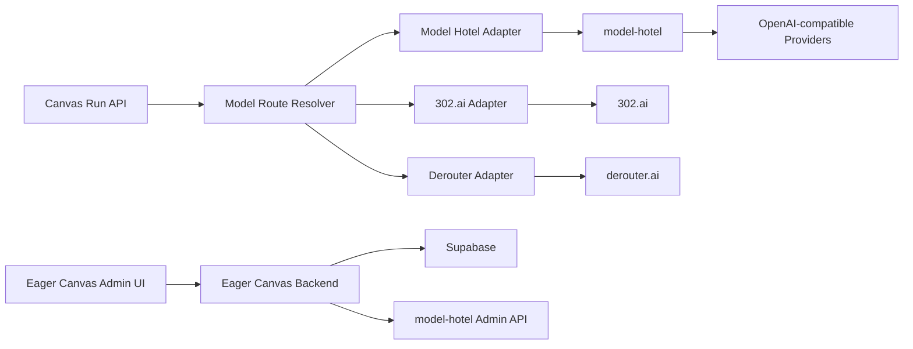

# Eager Canvas 多模型平台统一管理 PRD

> 文档状态：评估稿 / V1 PRD
> 基于代码基线：Eager Canvas 当前后端 302.ai 接入、`hugalafutro/model-hotel` 当前代码结构
> 编写日期：2026-05-27

---

## 1. 背景

Eager Canvas 当前后端的模型 API 基本都指向 302.ai。现有实现已经包含 302 Dashboard API、用户服务开通、用户级 302 API key、官方用量记录同步、图片/视频异步任务查询等能力，但 provider 层仍以 `PROVIDER_API_BASE_URL(S)` 和 `PROVIDER_API_KEY` 为核心，缺少可在后台统一管理的多平台模型路由。

业务目标是接入更多模型平台，例如 302.ai、derouter.ai、OpenRouter、OpenAI、Gemini、Claude、xAI 等，并允许后台快速新增平台、配置平台 key、指定某个业务模块或模型走某个平台。例如图片模块中的 `image2` 模型使用 derouter.ai 的 API，而聊天模型走 model-hotel 的多 LLM 网关。

`model-hotel` 是一个 OpenAI-compatible 多 provider AI gateway。它已经具备 provider 管理、模型发现、虚拟 API key、请求日志、failover、限流、健康与系统状态等能力。它适合作为 Eager Canvas 的 LLM 网关和用户虚拟 API key 管理组件，但不能直接覆盖 Eager Canvas 当前的图片、视频和 302 专有工作流。

---

## 2. 目标

### 2.1 产品目标

1. 后台可以快速添加、编辑、禁用 API 平台。
2. 后台可以为不同业务模块和模型指定平台，例如 `image.image2 -> derouter.ai`。
3. 后台可以查看平台健康状态、调用日志、错误率、延迟、余额或配额。
4. 用户 API 凭证统一由 model-hotel 生成虚拟 API key，并在 Eager Canvas 后台关联用户与服务权限。
5. 业务调用方不再直接感知 302.ai、derouter.ai 等上游平台差异，而是通过统一路由层调用。

### 2.2 技术目标

1. 将现有 302.ai 调用拆成 `302ai adapter`，保留当前图片、视频、账单能力。
2. 新增 `model-hotel adapter`，负责聊天类 OpenAI-compatible 模型和虚拟 key 管理。
3. 新增统一 `provider registry`、`model route policy`、`provider health`、`usage normalization`。
4. 支持平台级 fallback 和模型级指定路由。
5. 在不破坏当前 302.ai 生成链路的前提下逐步迁移。

---

## 3. 非目标

V1 不做以下内容：

1. 不把 Eager Canvas 后端整体替换为 model-hotel。
2. 不把图片、视频、异步任务全部迁入 model-hotel。
3. 不要求所有 provider 都支持官方账单同步。
4. 不做复杂竞价调度、成本最优自动路由、A/B 模型实验。
5. 不开放普通用户自行添加 provider key，V1 只由后台管理员管理。

---

## 4. 当前代码评估

### 4.1 Eager Canvas 当前可复用能力

当前项目已经有以下基础，适合继续扩展：

1. 后台 RBAC 与权限体系：`admin.*` 权限已经存在，可继续加 `admin.provider.*`、`admin.model_route.*`。
2. 用户服务凭证表：`user_service_credentials` 已经有 `provider` 字段，可扩展为 `model_hotel`、`302ai`、`internal` 等来源。
3. 用量事件表：`usage_events` 已经能记录 run、model、token、image、video、cost 等数据，可作为统一账单事件中心。
4. provider 调用层：`backend/src/services/provider.service.js` 已集中封装 chat/image/video/status，但文件过大且强绑定 302，需要拆 adapter。
5. 后台服务管理 UI：`AdminUsers.vue` 与 `useAdminServiceOps.js` 已覆盖 302 key、余额、API record，可演进成通用 provider 管理。

### 4.2 当前主要缺口

1. 没有平台表，provider 仍由环境变量控制。
2. 没有模型到平台的路由策略表。
3. `provider.service.js` 同时承担 provider client、业务参数转换、图片/视频任务编排、结果归一化，职责过重。
4. 用户 API key 创建强绑定 302 Dashboard API，不支持 model-hotel 虚拟 key。
5. 用量补全依赖 302 `requestId`，其他平台没有统一账单路径。

---

## 5. model-hotel 可借鉴和可复用内容

### 5.1 可直接复用的运行时能力

推荐以 sidecar 服务方式运行 model-hotel，而不是直接拷贝代码进 Eager Canvas。

可直接调用的能力：

1. `/api/providers`：provider CRUD，保存上游 base_url 与加密 API key。
2. `/api/models`：模型列表、模型启用/禁用、测试模型。
3. `/api/providers/{id}/discover`：从平台自动发现模型。
4. `/api/virtual-keys`：创建、查看、更新、删除虚拟 API key。
5. `/api/logs`：查看请求日志、状态码、延迟、token、failover attempt。
6. `/v1/models`：OpenAI-compatible 模型列表。
7. `/v1/chat/completions`：OpenAI-compatible 聊天代理。

### 5.2 可借鉴的数据结构

model-hotel 中值得映射到 Eager Canvas 设计的数据结构：

1. `providers`
   - `name`
   - `base_url`
   - `encrypted_key`
   - `masked_key`
   - `enabled`
   - `autodiscovery_enabled`
   - `last_discovered_at`
   - `last_used_at`

2. `models`
   - `provider_id`
   - `model_id`
   - `display_name`
   - `capabilities`
   - `input_modalities`
   - `output_modalities`
   - `context_length`
   - `max_output_tokens`
   - `input_price_per_million`
   - `output_price_per_million`
   - `enabled`
   - `disabled_manually`

3. `virtual_keys`
   - `name`
   - `key_hash`
   - `key_preview`
   - `tokens_used`
   - `last_used_at`
   - `rate_limit_rps`
   - `rate_limit_burst`

4. `request_logs`
   - `provider_id`
   - `model_id`
   - `status_code`
   - `latency_ms`
   - `duration_ms`
   - `ttft_ms`
   - `tokens_prompt`
   - `tokens_completion`
   - `virtual_key_id`
   - `error_message`
   - `state`

5. `model_failover_groups`
   - `display_model`
   - `priority_order`
   - `entry_enabled`
   - `group_enabled`
   - `auto_created`

### 5.3 可借鉴的代码结构

1. `internal/provider/*`
   - provider 类型识别
   - 模型发现
   - provider quota/balance 获取
   - 静态 catalog + live discovery 合并

2. `internal/proxy/*`
   - OpenAI-compatible 请求代理
   - provider/model 解析
   - hotel 模型 failover
   - streaming 与 non-streaming 日志

3. `internal/virtualkey/*`
   - `sk-` key 生成
   - SHA-256 hash 存储
   - key preview
   - 每 key 限流参数

4. `internal/failover/*`
   - 同模型多 provider 优先级
   - circuit breaker
   - 自动同步 failover group

### 5.4 不建议直接复用的部分

1. 不建议把 Eager Canvas 的图片、视频业务塞进 model-hotel 的 Go proxy。
2. 不建议把 Eager Canvas 用户体系迁移到 model-hotel。
3. 不建议让前端直接调用 model-hotel admin API，所有后台操作应通过 Eager Canvas 后端代理，并接入现有 RBAC 和审计。

---

## 6. 产品方案

### 6.1 后台平台管理

新增后台菜单：`/admin/providers`

核心功能：

1. 平台列表
   - 平台名称：302.ai、derouter.ai、model-hotel、OpenRouter 等
   - 平台类型：`native_302`、`openai_compatible`、`model_hotel`、`custom_http`
   - 支持能力：chat、image、image_edit、video、audio、embedding、billing、virtual_key
   - 状态：enabled、disabled、degraded、error
   - 最近健康检查时间
   - 最近错误

2. 添加平台
   - 名称
   - 类型
   - Base URL
   - API Key
   - 管理 API Key，可选
   - 能力勾选
   - 是否启用模型发现
   - 默认超时
   - 日限额、月限额，可选

3. 平台测试
   - 测试连接
   - 拉取模型
   - 试跑指定模型
   - 查看余额或配额，如果 provider 支持

4. 平台审计
   - 谁新增
   - 谁修改 key
   - 谁禁用平台
   - 谁修改模型路由

### 6.2 模型路由管理

新增后台菜单：`/admin/model-routes`

核心功能：

1. 模块维度路由
   - chat
   - image
   - image_edit
   - video
   - video_status
   - audio
   - embedding

2. 模型维度路由
   - 业务模型 key，例如 `image2`
   - 上游模型名，例如 `gpt-image-2`、`imagen-4`、`veo-3.1`
   - 指定平台，例如 `derouter.ai`
   - fallback 平台列表
   - 是否启用
   - 超时策略
   - 结果归一化 adapter

3. 示例配置

```json
{
  "module": "image",
  "businessModel": "image2",
  "providerCode": "derouter",
  "upstreamModel": "image2",
  "adapter": "openai_image",
  "fallbackProviderCodes": ["302ai"],
  "enabled": true,
  "timeoutMs": 180000
}
```

业务调用时，前端仍传 `model: "image2"`，后端通过路由策略解析到 derouter.ai，不要求前端知道上游平台。

### 6.3 用户 API 管理

新增后台菜单：`/admin/user-service`

V1 目标：用户 API key 由 model-hotel 创建虚拟 key，Eager Canvas 只保存虚拟 key 的元数据和用户关系。

流程：

1. 管理员为用户开通生成服务。
2. Eager Canvas 后端调用 model-hotel `POST /api/virtual-keys`。
3. model-hotel 返回明文 `sk-...`，仅本次可见。
4. Eager Canvas 保存：
   - `user_id`
   - `provider = model_hotel`
   - `model_hotel_virtual_key_id`
   - `key_preview`
   - `status`
   - `rate_limit_rps`
   - `rate_limit_burst`
   - `created_by`
5. 运行时 Eager Canvas 使用该虚拟 key 调用 model-hotel `/v1/chat/completions`。
6. 用户停用时，Eager Canvas 调用 model-hotel `DELETE /api/virtual-keys/{id}` 或将 key 限流降为 0。

注意：如果 Eager Canvas 服务端需要代表用户调用图片/视频平台，仍由 Eager Canvas 的 provider adapter 使用平台级 key 或用户级平台 key。model-hotel 虚拟 key 只覆盖 model-hotel 代理的 LLM 调用。

---

## 7. 技术架构

### 7.1 推荐架构



核心原则：

1. Eager Canvas 是业务编排中心。
2. model-hotel 是 LLM 网关和虚拟 key 服务。
3. 302.ai、derouter.ai 等图片/视频平台由 Eager Canvas adapter 直接管理。
4. 所有后台管理入口仍走 Eager Canvas RBAC。

### 7.2 后端模块拆分

新增或拆分以下模块：

1. `backend/src/services/model-provider-registry.service.js`
   - 平台 CRUD
   - 平台能力配置
   - 加密 key 管理

2. `backend/src/services/model-route.service.js`
   - 根据 module + business model 找到 provider
   - 处理 fallback
   - 返回 adapter 调用配置

3. `backend/src/services/model-hotel.service.js`
   - 调用 model-hotel admin API
   - 管理 virtual keys
   - 调用 `/v1/models` 与 `/v1/chat/completions`
   - 拉取 logs/stats

4. `backend/src/providers/302ai.adapter.js`
   - 迁移现有 302 chat/image/video/status/record 逻辑

5. `backend/src/providers/derouter.adapter.js`
   - V1 先支持 OpenAI-compatible image/chat
   - 按 derouter 实际接口补充 status/billing

6. `backend/src/providers/model-hotel.adapter.js`
   - chat
   - model list
   - usage logs
   - virtual key lifecycle

7. `backend/src/services/provider-health.service.js`
   - 周期健康检查
   - 最近错误记录
   - provider 状态更新

### 7.3 数据库建议

新增 migration：`supabase/011_multi_provider_model_gateway.sql`

建议新增表：

1. `model_api_providers`
   - `id uuid`
   - `code text unique`
   - `name text`
   - `type text`
   - `base_url text`
   - `admin_base_url text`
   - `api_key_encrypted text`
   - `admin_api_key_encrypted text`
   - `key_last4 text`
   - `capabilities jsonb`
   - `status text`
   - `enabled boolean`
   - `priority integer`
   - `timeout_ms integer`
   - `last_health_status text`
   - `last_health_checked_at timestamptz`
   - `last_error text`

2. `model_provider_models`
   - `id uuid`
   - `provider_id uuid`
   - `model_key text`
   - `upstream_model text`
   - `display_name text`
   - `module text`
   - `capabilities jsonb`
   - `pricing jsonb`
   - `enabled boolean`
   - `last_seen_at timestamptz`

3. `model_route_policies`
   - `id uuid`
   - `module text`
   - `business_model text`
   - `provider_id uuid`
   - `provider_model_id uuid`
   - `adapter text`
   - `fallback_provider_ids uuid[]`
   - `timeout_ms integer`
   - `enabled boolean`
   - `created_by uuid`
   - `updated_by uuid`

4. `model_hotel_virtual_key_links`
   - `id uuid`
   - `user_id uuid`
   - `model_hotel_virtual_key_id text`
   - `key_preview text`
   - `rate_limit_rps numeric`
   - `rate_limit_burst integer`
   - `status text`
   - `created_by uuid`
   - `created_at timestamptz`
   - `disabled_at timestamptz`

5. `provider_health_events`
   - `id uuid`
   - `provider_id uuid`
   - `status text`
   - `latency_ms integer`
   - `error_message text`
   - `checked_at timestamptz`

建议扩展现有表：

1. `user_service_credentials`
   - 增加 `external_key_id text`
   - 增加 `key_preview text`
   - `provider` 从默认 `302ai` 扩展为 `model_hotel`、`302ai`、`derouter`。

2. `usage_events`
   - 增加 `provider_code text`
   - 增加 `provider_model text`
   - 增加 `route_policy_id uuid`
   - 增加 `billing_source text`，值为 `official`、`model_hotel_log`、`response_usage`、`estimated`。

---

## 8. API 设计

### 8.1 后台 Provider API

```http
GET /admin/model-providers
POST /admin/model-providers
GET /admin/model-providers/:id
PATCH /admin/model-providers/:id
DELETE /admin/model-providers/:id
POST /admin/model-providers/:id/test
POST /admin/model-providers/:id/discover-models
GET /admin/model-providers/:id/health-events
```

### 8.2 后台模型路由 API

```http
GET /admin/model-routes
POST /admin/model-routes
PATCH /admin/model-routes/:id
DELETE /admin/model-routes/:id
POST /admin/model-routes/:id/test
```

### 8.3 用户虚拟 key API

```http
POST /admin/users/:userId/model-hotel-service/activate
PATCH /admin/users/:userId/model-hotel-service/limits
POST /admin/users/:userId/model-hotel-service/disable
POST /admin/users/:userId/model-hotel-service/reset
GET /admin/users/:userId/model-hotel-service
```

### 8.4 运行时路由 API

运行时对前端保持兼容：

```http
POST /runs/compat/chat/completions
POST /runs/compat/images/generations
POST /runs/compat/videos
GET /runs/compat/videos/:taskId
```

后端内部改为：

1. `createRun()` 调用 `resolveModelRoute({ type, model })`。
2. 根据 route 选择 adapter。
3. adapter 返回统一结果结构。
4. `usage_events` 写入 provider、route、billing source。

---

## 9. 关键业务流程

### 9.1 添加 derouter.ai 并绑定 image2

1. 管理员进入 `/admin/providers`。
2. 点击添加平台，选择 `openai_compatible` 或 `custom_http`。
3. 填写：
   - code：`derouter`
   - name：`derouter.ai`
   - base_url：derouter API base URL
   - api_key：平台 key
   - capabilities：image、chat，按实际能力选择
4. 点击测试连接。
5. 点击发现模型或手动添加 `image2`。
6. 进入 `/admin/model-routes`。
7. 新增路由：
   - module：`image`
   - business_model：`image2`
   - provider：`derouter`
   - upstream_model：`image2`
   - adapter：`openai_image` 或 `derouter_image`
   - fallback：`302ai`
8. 前端图片节点继续传 `model: "image2"`。
9. 后端解析后调用 derouter.ai。
10. derouter.ai 失败且错误可重试时 fallback 到 302.ai。

### 9.2 用户 API 由 model-hotel 生成

1. 管理员在用户管理页点击开通生成服务。
2. Eager Canvas 后端校验 `admin.service_access.activate`。
3. 后端调用 model-hotel `POST /api/virtual-keys`：

```json
{
  "name": "eager_user_<user_id>",
  "rate_limit_rps": 1,
  "rate_limit_burst": 5
}
```

4. model-hotel 返回：

```json
{
  "id": "virtual-key-id",
  "name": "eager_user_8f1c2a4b",
  "key": "sk-example-generated-once",
  "key_preview": "sk-...ce"
}
```

5. Eager Canvas 保存虚拟 key ID、preview、状态、限流。
6. 后台只展示 preview，不再次展示明文 key。
7. 聊天请求进入 `model-hotel.adapter` 时，后端使用该用户对应的虚拟 key 调用 model-hotel `/v1/chat/completions`。

### 9.3 图片与视频仍由业务 adapter 管理

1. 图片、视频请求进入 `createRun()`。
2. 后端按 `type + model` 查询 `model_route_policies`。
3. 如果 route 指向 302.ai，调用 `302ai.adapter`。
4. 如果 route 指向 derouter.ai，调用 `derouter.adapter`。
5. 如果 route 指向 model-hotel，但 module 不是 chat，V1 应拒绝并提示该 route 不支持。

---

## 10. 里程碑

### Phase 0：方案冻结与 model-hotel 部署验证，1 天

交付：

1. 启动 model-hotel sidecar。
2. 创建一个 provider 与 virtual key。
3. Eager Canvas 后端能用 virtual key 调通 `/v1/chat/completions`。
4. 明确 derouter.ai 的 API 形态，判断使用 `openai_compatible` 还是自定义 adapter。

验收：

1. model-hotel `/v1/models` 可用。
2. model-hotel `/api/virtual-keys` 可创建 key。
3. Eager Canvas 后端能通过配置访问 model-hotel admin API。

### Phase 1：Provider Registry 与路由表，3-5 天

交付：

1. 新增数据库表。
2. 新增 provider CRUD service。
3. 新增 model route policy service。
4. 新增后台 API。
5. 将现有 302.ai 配置导入为默认 provider。

验收：

1. 后台可以新增 derouter.ai。
2. 后台可以配置 `image.image2 -> derouter`。
3. 未配置 route 的模型仍走 302.ai 兼容默认值。

### Phase 2：Adapter 拆分与运行时接入，5-8 天

交付：

1. 拆分 `302ai.adapter.js`。
2. 新增 `model-hotel.adapter.js`。
3. 新增 `derouter.adapter.js`。
4. `createRun()` 改为先 resolve route，再调用 adapter。
5. 用量事件写入 provider 与 route 信息。

验收：

1. chat 可通过 model-hotel 路由。
2. `image2` 可按后台配置走 derouter.ai。
3. 302.ai 原图片/视频模型保持兼容。
4. 失败时 fallback 行为可控。

### Phase 3：后台 UI，4-6 天

交付：

1. `/admin/providers`
2. `/admin/model-routes`
3. 用户服务页新增 model-hotel virtual key 状态。
4. 平台健康与最近错误展示。

验收：

1. 管理员无需改环境变量即可新增平台。
2. 管理员无需发版即可切换 `image2` 使用的平台。
3. 用户服务开通、停用、重置走 model-hotel virtual key。

### Phase 4：监控与账单归一化，4-7 天

交付：

1. 同步 model-hotel logs。
2. 302 官方账单继续 reconciliation。
3. derouter.ai 若无官方账单则使用响应 usage 或价格表估算。
4. 后台按 provider、model、user 查看用量。

验收：

1. usage 事件均有 `provider_code`。
2. billing source 可区分 official、model_hotel_log、response_usage、estimated。
3. 管理员能定位某 provider 错误率和成本趋势。

---

## 11. 收益

### 11.1 产品收益

1. 平台添加从发版改为后台配置。
2. 单模型可快速切换平台，例如 `image2` 从 302.ai 切到 derouter.ai。
3. 用户 API 管理统一收敛到 virtual key，不再散落在不同 provider。
4. 模型选择、平台选择、用户服务开通可由运营后台完成。

### 11.2 技术收益

1. `provider.service.js` 复杂度下降，新增平台不再继续堆 if/else。
2. 302.ai 专有逻辑被隔离，后续接入新平台风险降低。
3. model-hotel 提供成熟的 LLM provider 管理、failover、日志和虚拟 key。
4. 路由策略表让模型路由可审计、可回滚。

### 11.3 运维收益

1. provider 健康状态可视化。
2. 平台异常时可快速切换 fallback。
3. 日志与账单来源更清晰。
4. 降低单一 302.ai 平台故障对业务的影响。

---

## 12. 风险与应对

### 12.1 model-hotel 能力边界风险

风险：model-hotel 当前核心代理路径是 `/v1/chat/completions` 和 `/v1/models`，不覆盖当前图片/视频专有 API。

应对：model-hotel 只作为 LLM gateway 与 virtual key 服务。图片/视频仍由 Eager Canvas adapter 直接管理。

### 12.2 双系统 key 管理复杂度

风险：Eager Canvas 和 model-hotel 都涉及 key，容易出现状态不一致。

应对：Eager Canvas 保存 model-hotel virtual key ID 和 preview，生命周期操作统一从 Eager Canvas 后端代理到 model-hotel，所有操作写 admin audit log。

### 12.3 账单不一致

风险：302.ai 有官方 record，其他 provider 可能只有响应 usage 或无 usage。

应对：引入 `billing_source` 字段。官方账单标记 `official`，model-hotel 日志标记 `model_hotel_log`，响应 usage 标记 `response_usage`，价格表估算标记 `estimated`。

### 12.4 路由错误导致模型不可用

风险：后台配置错误会让某业务模型不可用。

应对：route 保存前必须支持 test；运行时保留 fallback；route 修改写审计；支持一键禁用新 route 回退默认 302。

### 12.5 derouter.ai 接口不确定

风险：如果 derouter.ai 不是完全 OpenAI-compatible，通用 adapter 不够。

应对：Phase 0 先验证 derouter.ai API 形态。如果不兼容，新增 `derouter.adapter.js`，只实现所需 image2 能力。

### 12.6 安全风险

风险：后台新增 provider key 与 model-hotel admin token 都是高敏凭证。

应对：key 加密存储；后台不回显明文；接口需 `admin.provider.manage`；所有 key 变更写审计；model-hotel admin API 仅允许后端访问。

---

## 13. 权限设计

新增权限：

1. `admin.provider.read`
2. `admin.provider.manage`
3. `admin.provider.test`
4. `admin.model_route.read`
5. `admin.model_route.manage`
6. `admin.model_route.test`
7. `admin.model_hotel_key.manage`
8. `admin.provider_health.read`

默认授权：

1. `super_admin`：全部权限。
2. `admin`：全部 provider 与 route 权限。
3. `ops`：read/test/health 权限，不允许修改 key 和 route。
4. `support`：无 provider 管理权限。

---

## 14. 验收标准

V1 完成时必须满足：

1. 后台可新增 `derouter.ai` 平台，无需改环境变量。
2. 后台可将 `image2` 路由到 `derouter.ai`。
3. 后台可将 `image2` fallback 到 302.ai。
4. 聊天模型可通过 model-hotel 调用至少一个 OpenAI-compatible provider。
5. 用户服务开通可由 Eager Canvas 后端调用 model-hotel 创建 virtual key。
6. 用户服务停用可同步禁用或删除 model-hotel virtual key。
7. 所有 run 的 `usage_events` 至少记录 provider code、model、route policy、billing source。
8. provider key 不在任何 API 响应中明文返回。
9. provider 与 route 变更写入 admin audit log。
10. 当前 302.ai 图片/视频流程不回退、不丢失任务状态查询能力。

---

## 15. 推荐结论

推荐采用“Eager Canvas 业务编排层 + model-hotel LLM 网关 + provider adapter”的混合架构。

理由：

1. model-hotel 已经实现多 LLM provider 管理、模型发现、虚拟 key、日志、failover，这部分直接复用收益最高。
2. Eager Canvas 当前图片/视频生成与 302.ai 专有接口耦合较深，直接迁入 model-hotel 成本高且风险大。
3. provider registry 和 route policy 留在 Eager Canvas，可以支持 `image2 -> derouter.ai` 这种业务模块级路由。
4. 用户 API 由 model-hotel 生成虚拟 key，可以统一聊天类 API 的限流和日志，同时不阻塞图片/视频 adapter 的独立演进。
