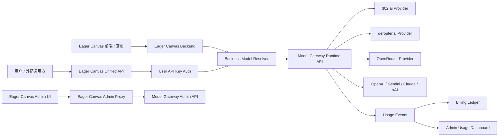

# Eager Canvas Model Gateway PRD

> 文档状态：V2 修订稿  
> 核心结论：Eager Canvas 不应继续围绕 302.ai 单平台后台补功能，而应建设统一模型路由与计费中台。302.ai、derouter.ai、OpenRouter、OpenAI、Gemini、Claude、xAI 等平台全部作为上游 Provider 接入统一网关，由网关生成统一 API Key、统一路由、统一记录用量、统一计费归因。  
> 更新时间：2026-06-01

---

## 1. 背景

Eager Canvas 当前项目同时使用 302.ai 和 derouter.ai 两个 API 聚合平台，但后台管理界面主要围绕 302.ai 的数据展开。这个设计在单平台阶段可以工作，但在多平台、多模型、多计费单位的业务环境下，会导致后台数据不完整、成本不可解释、模型路由不可控。

当前核心问题不是“后台缺少 derouter.ai 数据展示”，而是缺少一个统一的模型网关层。

如果继续在 Eager Canvas 后台中直接堆叠 302.ai、derouter.ai、OpenRouter 等平台管理逻辑，系统会逐步变成多个供应商后台的拼接页面。短期能解决展示问题，长期会带来以下风险：

1. 每新增一个平台，都要新增一套 Provider Adapter、模型列表、余额查询、用量同步、错误码映射和后台页面。
2. 用户调用的是 Eager Canvas 能力，但真实用量分散在不同上游平台，无法稳定归因。
3. 图片、视频、文本模型计费单位不同，不能只用 token 或 302.ai 官方账单代表完整业务消耗。
4. 模型路由分散在代码和环境变量里，后续切换模型、降级、fallback、灰度发布都会失控。
5. 用户侧 API Key、限流、额度、套餐、扣费与上游供应商耦合，无法形成自己的商业化闭环。

因此，本 PRD 的目标不是“给后台增加 derouter.ai 页面”，而是建设 Eager Canvas Model Gateway。

---

## 2. 一句话定义

Eager Canvas Model Gateway 是 Eager Canvas 的统一模型路由与计费中台，负责统一接入 302.ai、derouter.ai、OpenRouter、OpenAI、Gemini、Claude、xAI 等上游模型平台，并向 Eager Canvas 用户分发统一 API Key，完成模型路由、调用日志、用量归因、成本核算、限流控制和计费流水。

---

## 3. 总体结论

该需求可以实现，并且是当前 Eager Canvas 后台继续扩展前必须补齐的基础能力。

推荐架构为：

1. Eager Canvas 保留业务系统定位，负责用户、画布、项目、workflow run、媒体库、后台权限和业务模型 key。
2. Model Gateway 或 model-hotel 作为唯一模型聚合网关，负责 Provider、模型发现、模型启停、路由、虚拟 API Key、请求日志、限流、failover 和健康状态。
3. 302.ai、derouter.ai、OpenRouter、OpenAI、Gemini、Claude、xAI 等都作为 Provider 接入 Model Gateway。
4. Eager Canvas 不再直接保存多平台真实 API Key，不再长期维护独立 `302ai.adapter.js`、`derouter.adapter.js` 作为主路径。
5. Eager Canvas 后台只代理 Model Gateway Admin API，并根据自身 RBAC 做权限控制和审计。
6. 用户只拿到 Eager Canvas 分发的统一 API Key，不感知实际调用的是 302.ai、derouter.ai 还是其他平台。

---

## 4. 目标

### 4.1 产品目标

1. 后台统一管理所有上游模型平台。
2. 后台统一管理业务模型到真实 Provider Model 的路由关系。
3. 为用户生成统一 API Key，屏蔽上游供应商差异。
4. 每一次模型调用都生成标准化 usage event。
5. 将 token、图片张数、视频秒数、异步任务、失败重试等不同用量单位统一记录。
6. 将上游成本、内部成本、用户扣费拆分记录，支持后续利润分析。
7. 支持模型 fallback、平台健康状态、限流和异常追踪。
8. 后台能按用户、模型、Provider、时间维度查看真实消耗。

### 4.2 业务目标

1. 解决当前后台只能管理 302.ai 数据的问题。
2. 让 derouter.ai、302.ai 等平台在后台中拥有统一管理口径。
3. 让 Eager Canvas 拥有自己的 API 分发能力，而不是依赖上游平台账号体系。
4. 为未来套餐、充值、余额、扣费、利润报表打基础。
5. 降低后续接入新模型平台的开发成本。

### 4.3 技术目标

1. 将模型调用入口统一收敛到 Model Gateway。
2. 将模型路由从业务代码中抽离成可配置数据。
3. 将 Provider API Key 从 Eager Canvas 业务服务中抽离。
4. 对 OpenAI-compatible 平台优先复用通用 adapter。
5. 对 302.ai 等专有接口通过 gateway adapter 或 endpoint template 扩展。
6. 所有调用日志可追踪到 user、run、business_model、gateway_model、provider、request_id、task_id。

---

## 5. 非目标

V1 不做以下内容：

1. 不做完整商业化套餐系统。
2. 不做复杂成本最优调度。
3. 不做 A/B 实验和竞价路由。
4. 不一次性覆盖所有 302.ai 视频专有接口。
5. 不把 Eager Canvas 用户体系迁移到 Model Gateway。
6. 不允许 Eager Canvas 前端直接访问 Model Gateway Admin API。
7. 不把 usage event 和 billing ledger 混成一张表。
8. 不继续在 Eager Canvas 中新增长期独立的多 Provider Key 管理系统。

---

## 6. 核心架构



---

## 7. 职责边界

### 7.1 Eager Canvas 负责

1. 用户、登录、权限、RBAC。
2. 项目、画布、节点、workflow run、媒体库。
3. 业务模型 key，例如 `image2`、`gpt-image-2`、`kling-o3`。
4. 将业务模型 key 解析到 gateway model。
5. 将 gateway 日志映射回用户、run、项目和业务模块。
6. 后台管理页面和权限代理。
7. 业务侧 usage event、billing ledger、用户余额和套餐。

### 7.2 Model Gateway 负责

1. Provider 管理。
2. Provider API Key 加密保存。
3. 模型发现。
4. 模型启用、禁用、测试。
5. Runtime API 请求代理。
6. 虚拟 API Key。
7. Provider 健康状态。
8. 请求日志。
9. 限流。
10. Failover。
11. Provider adapter。
12. 上游错误码归一。

### 7.3 上游 Provider 负责

1. 实际模型推理。
2. 官方账单或官方用量。
3. 模型平台侧任务状态。
4. 平台侧限流、余额、错误信息。

### 7.4 关键原则

1. 真实 Provider API Key 不暴露给 Eager Canvas 用户。
2. Eager Canvas 用户不直接调用 302.ai 或 derouter.ai。
3. 新增 Provider 优先接入 Model Gateway，不直接写入 Eager Canvas 业务代码。
4. Eager Canvas 只认业务模型 key，Gateway 负责解析到真实模型。
5. usage event 记录事实，billing ledger 记录财务流水，二者必须分离。

---

## 8. 后台信息架构

新增一级菜单：

```text
模型网关
├── Provider 管理
├── 模型列表
├── 模型路由
├── 用户 API Key
├── 调用日志
├── 用量统计
└── 计费规则
```

---

## 9. 后台模块设计

### 9.1 Provider 管理

路径：

```text
/admin/model-gateway/providers
```

功能：

1. Provider 列表。
2. 新增 Provider。
3. 编辑 Provider。
4. 启用 / 禁用 Provider。
5. 测试 Provider 连接。
6. 拉取 Provider 模型列表。
7. 查看 Provider 健康状态。
8. 查看最近错误。
9. 查看余额或配额，前提是 Provider 支持。

Provider 列表字段：

| 字段 | 说明 |
|---|---|
| name | Provider 名称，例如 `302ai`、`derouter` |
| provider_type | `openai_compatible`、`302ai_custom`、`derouter_custom` |
| base_url | Provider API 地址 |
| masked_key | 脱敏 key |
| enabled | 是否启用 |
| capabilities | 支持能力 |
| model_count | 模型数量 |
| health_status | 健康状态 |
| last_discovered_at | 最近发现模型时间 |
| last_used_at | 最近调用时间 |
| last_error | 最近错误 |

Provider capabilities：

```json
{
  "chat": true,
  "image_generation": true,
  "image_edit": true,
  "video_generation": false,
  "video_status": false,
  "billing": false,
  "quota": false,
  "openai_compatible": true
}
```

---

### 9.2 模型列表

路径：

```text
/admin/model-gateway/models
```

功能：

1. 查看所有 Provider 下的模型。
2. 按 Provider、能力、状态筛选。
3. 启用 / 禁用模型。
4. 测试模型。
5. 设置模型 metadata。
6. 设置模型成本参数。
7. 设置输入输出 modality。

模型字段：

| 字段 | 说明 |
|---|---|
| gateway_model | 例如 `derouter/image2` |
| provider | 例如 `derouter` |
| provider_model | 上游真实模型名 |
| capability | `chat`、`image_generation`、`image_edit`、`video_generation` |
| input_modalities | `text`、`image`、`audio`、`video` |
| output_modalities | `text`、`image`、`video` |
| async_mode | 是否异步 |
| status_endpoint | 异步状态查询 endpoint |
| enabled | 是否启用 |
| cost_rule_id | 成本规则 |
| last_test_status | 最近测试状态 |

---

### 9.3 模型路由

路径：

```text
/admin/model-gateway/routes
```

作用：

将 Eager Canvas 的业务模型 key 映射到 Model Gateway 中的 gateway model 或 failover group。

示例：

```json
{
  "module": "image",
  "business_model": "image2",
  "gateway_model": "derouter/image2",
  "runtime_endpoint": "/v1/images/generations",
  "fallback_gateway_models": ["302ai/image2"],
  "enabled": true,
  "timeout_ms": 180000,
  "legacy_direct_fallback": false
}
```

字段：

| 字段 | 说明 |
|---|---|
| module | `chat`、`image`、`image_edit`、`video` |
| business_model | 前端和 workflow 使用的模型 key |
| gateway_model | Gateway 中的模型 id |
| runtime_endpoint | Gateway runtime endpoint |
| fallback_gateway_models | fallback 模型列表 |
| timeout_ms | 超时时间 |
| enabled | 是否启用 |
| legacy_direct_fallback | 是否允许回退旧直连逻辑 |

路由优先级：

1. 如果配置了 `hotel/<model>` 或 failover group，优先走 group。
2. 如果业务要求固定供应商，走指定 `provider/model`。
3. 如果 Gateway 暂不支持该 endpoint，才允许短期走 legacy direct path。
4. legacy direct path 必须标记，并在 V2 后逐步下线。

---

### 9.4 用户 API Key

路径：

```text
/admin/model-gateway/user-keys
```

目标：

为 Eager Canvas 用户生成统一 API Key。用户只使用 Eager Canvas 分发的 key，不感知上游供应商。

用户调用示例：

```http
POST /v1/images/generations
Authorization: Bearer sk-eager-xxxxxx
Content-Type: application/json
```

```json
{
  "model": "image2",
  "prompt": "A cinematic product render..."
}
```

后台流程：

1. 管理员为用户开通模型服务。
2. Eager Canvas 调用 Model Gateway 创建 virtual key。
3. Gateway 返回 raw key，仅展示一次。
4. Eager Canvas 保存 key preview、gateway key id、user_id、状态和限流配置。
5. 用户请求进入 Eager Canvas API 后，先校验 key，再进入 business model resolver。
6. 停用用户服务时，Eager Canvas 调用 Gateway 禁用 virtual key，并同步本地状态。

字段：

| 字段 | 说明 |
|---|---|
| user_id | Eager Canvas 用户 |
| gateway_virtual_key_id | Gateway key id |
| key_preview | 脱敏 key |
| status | active / disabled |
| rate_limit_rps | 每秒请求限制 |
| rate_limit_burst | 突发限制 |
| allowed_models | 允许使用的业务模型 |
| monthly_quota | 月额度 |
| created_by | 创建人 |
| last_used_at | 最近使用时间 |

---

### 9.5 调用日志

路径：

```text
/admin/model-gateway/logs
```

每一次模型调用都必须生成标准日志。

日志字段：

| 字段 | 说明 |
|---|---|
| request_id | 请求 ID |
| user_id | 用户 ID |
| project_id | 项目 ID |
| run_id | workflow run ID |
| node_id | 节点 ID |
| module | 模块 |
| business_model | 业务模型 |
| gateway_provider | 实际 Provider |
| gateway_model | 实际模型 |
| gateway_virtual_key_id | Gateway key id |
| status | success / failed / timeout |
| error_code | 归一错误码 |
| provider_error_code | 上游错误码 |
| latency_ms | 请求耗时 |
| task_id | 异步任务 ID |
| input_tokens | 输入 token |
| output_tokens | 输出 token |
| image_count | 图片张数 |
| video_seconds | 视频秒数 |
| provider_cost | 上游成本 |
| user_bill_amount | 用户扣费 |
| billing_source | 计费来源 |

日志筛选维度：

1. 用户。
2. Provider。
3. 模型。
4. 模块。
5. 状态。
6. 时间范围。
7. request_id。
8. run_id。
9. task_id。

---

### 9.6 用量统计

路径：

```text
/admin/model-gateway/usage
```

统计维度：

1. 按用户。
2. 按 Provider。
3. 按业务模型。
4. 按 gateway model。
5. 按项目。
6. 按日期。
7. 按模块。

核心指标：

| 指标 | 说明 |
|---|---|
| total_requests | 总请求数 |
| success_requests | 成功请求 |
| failed_requests | 失败请求 |
| total_input_tokens | 输入 token |
| total_output_tokens | 输出 token |
| total_images | 图片生成数量 |
| total_video_seconds | 视频秒数 |
| provider_cost | 上游总成本 |
| user_bill_amount | 用户扣费金额 |
| gross_margin | 毛利 |
| avg_latency_ms | 平均耗时 |
| failure_rate | 失败率 |

---

### 9.7 计费规则

路径：

```text
/admin/model-gateway/pricing
```

计费规则需要同时支持成本价和用户售价。

计费对象：

1. 文本模型：按 input token / output token。
2. 图片生成：按张数、分辨率、模型倍率。
3. 图片编辑：按张数、输入图数量、模型倍率。
4. 视频生成：按秒数、分辨率、模型倍率。
5. 异步任务：按成功任务、失败是否计费、重试是否计费。

建议拆分三类金额：

```text
provider_cost     = 上游实际成本
internal_cost     = 内部归一成本
user_bill_amount  = 用户实际扣费金额
```

不要把三者混成一个字段。

---

## 10. Runtime API 设计

### 10.1 统一图片生成 API

```http
POST /v1/images/generations
Authorization: Bearer sk-eager-xxxxxx
Content-Type: application/json
```

```json
{
  "model": "image2",
  "prompt": "A modern bathroom product render",
  "size": "1024x1024",
  "n": 1
}
```

处理流程：

1. 校验 Eager Canvas 用户 API Key。
2. 解析用户权限和额度。
3. 根据 `model=image2` 查询 `model_gateway_routes`。
4. 解析到 `derouter/image2` 或其他 gateway model。
5. 调用 Gateway runtime endpoint。
6. 写入 usage event。
7. 根据计费规则写入 billing ledger。
8. 返回统一响应。

统一响应：

```json
{
  "id": "req_xxx",
  "object": "image.generation",
  "created": 1780300000,
  "model": "image2",
  "data": [
    {
      "url": "https://..."
    }
  ],
  "usage": {
    "image_count": 1,
    "provider": "derouter",
    "gateway_model": "derouter/image2",
    "bill_amount": 0.08
  }
}
```

---

### 10.2 统一视频生成 API

```http
POST /v1/videos/generations
Authorization: Bearer sk-eager-xxxxxx
Content-Type: application/json
```

```json
{
  "model": "kling-o3",
  "prompt": "A cinematic product video",
  "duration": 5,
  "aspect_ratio": "16:9"
}
```

视频任务响应：

```json
{
  "id": "task_xxx",
  "object": "video.task",
  "status": "queued",
  "model": "kling-o3"
}
```

状态查询：

```http
GET /v1/videos/tasks/task_xxx
Authorization: Bearer sk-eager-xxxxxx
```

统一状态：

```json
{
  "id": "task_xxx",
  "status": "succeeded",
  "video_url": "https://...",
  "usage": {
    "video_seconds": 5,
    "provider": "302ai",
    "gateway_model": "302ai/kling-o3",
    "bill_amount": 3.0
  }
}
```

---

### 10.3 统一 Chat API

```http
POST /v1/chat/completions
Authorization: Bearer sk-eager-xxxxxx
Content-Type: application/json
```

```json
{
  "model": "gpt-4o",
  "messages": [
    {
      "role": "user",
      "content": "Summarize this design brief"
    }
  ]
}
```

---

## 11. 数据库设计

### 11.1 `model_gateway_routes`

保存业务模型到 gateway model 的映射。

```sql
create table if not exists model_gateway_routes (
  id uuid primary key default gen_random_uuid(),
  module text not null,
  business_model text not null,
  gateway_model text not null,
  runtime_endpoint text not null,
  fallback_gateway_models jsonb not null default '[]'::jsonb,
  timeout_ms integer not null default 180000,
  enabled boolean not null default true,
  legacy_direct_fallback boolean not null default false,
  created_by uuid,
  updated_by uuid,
  created_at timestamptz not null default now(),
  updated_at timestamptz not null default now(),
  unique(module, business_model)
);
```

---

### 11.2 `model_hotel_virtual_key_links`

保存 Eager Canvas 用户与 Gateway virtual key 的关系。

```sql
create table if not exists model_hotel_virtual_key_links (
  id uuid primary key default gen_random_uuid(),
  user_id uuid not null,
  model_hotel_virtual_key_id text not null,
  key_preview text not null,
  status text not null default 'active',
  rate_limit_rps numeric,
  rate_limit_burst integer,
  allowed_models jsonb not null default '[]'::jsonb,
  monthly_quota numeric,
  created_by uuid,
  created_at timestamptz not null default now(),
  disabled_at timestamptz,
  last_used_at timestamptz,
  last_error text
);
```

---

### 11.3 `model_gateway_provider_cache`

Provider 缓存表，仅用于后台提速，不作为真实来源。

```sql
create table if not exists model_gateway_provider_cache (
  provider_id text primary key,
  name text not null,
  provider_type text,
  base_url text,
  enabled boolean,
  capabilities jsonb not null default '{}'::jsonb,
  model_count integer not null default 0,
  health_status text,
  last_discovered_at timestamptz,
  last_used_at timestamptz,
  last_synced_at timestamptz not null default now(),
  last_error text,
  raw jsonb not null default '{}'::jsonb
);
```

---

### 11.4 `model_pricing_rules`

保存模型计费规则。

```sql
create table if not exists model_pricing_rules (
  id uuid primary key default gen_random_uuid(),
  name text not null,
  module text not null,
  business_model text,
  gateway_model text,
  pricing_unit text not null,
  provider_cost_rate numeric,
  internal_cost_rate numeric,
  user_price_rate numeric not null,
  currency text not null default 'USD',
  config jsonb not null default '{}'::jsonb,
  enabled boolean not null default true,
  created_at timestamptz not null default now(),
  updated_at timestamptz not null default now()
);
```

`pricing_unit` 可选：

```text
input_token
output_token
image_count
video_second
task
custom
```

---

### 11.5 `usage_events`

记录事实用量。该表不直接代表财务扣费，只记录模型调用事实。

```sql
create table if not exists usage_events (
  id uuid primary key default gen_random_uuid(),
  request_id text not null,
  user_id uuid,
  project_id uuid,
  run_id uuid,
  node_id text,
  module text not null,
  business_model text not null,
  gateway_provider text,
  gateway_model text,
  gateway_virtual_key_id text,
  gateway_log_id text,
  provider_request_id text,
  task_id text,
  status text not null,
  error_code text,
  provider_error_code text,
  latency_ms integer,
  input_tokens integer not null default 0,
  output_tokens integer not null default 0,
  image_count integer not null default 0,
  video_seconds numeric not null default 0,
  provider_cost numeric,
  internal_cost numeric,
  estimated_cost numeric,
  billing_source text,
  raw_request jsonb,
  raw_response jsonb,
  created_at timestamptz not null default now()
);
```

`billing_source` 可选：

```text
model_gateway_log
provider_official
response_usage
estimated
legacy_302
manual_adjustment
```

---

### 11.6 `billing_ledger`

记录财务流水。该表用于用户余额、扣费、退款、补扣、赠送额度。

```sql
create table if not exists billing_ledger (
  id uuid primary key default gen_random_uuid(),
  user_id uuid not null,
  usage_event_id uuid references usage_events(id),
  type text not null,
  amount numeric not null,
  currency text not null default 'USD',
  balance_before numeric,
  balance_after numeric,
  description text,
  metadata jsonb not null default '{}'::jsonb,
  created_by uuid,
  created_at timestamptz not null default now()
);
```

`type` 可选：

```text
charge
refund
adjustment
grant
recharge
```

---

### 11.7 `provider_billing_sync_logs`

记录从上游 Provider 同步官方用量或账单的结果。

```sql
create table if not exists provider_billing_sync_logs (
  id uuid primary key default gen_random_uuid(),
  provider text not null,
  sync_start_at timestamptz not null,
  sync_end_at timestamptz,
  status text not null,
  matched_usage_count integer not null default 0,
  unmatched_usage_count integer not null default 0,
  total_provider_cost numeric,
  error_message text,
  raw jsonb not null default '{}'::jsonb,
  created_at timestamptz not null default now()
);
```

---

## 12. 后端服务设计

### 12.1 `model-gateway-admin.service`

职责：

1. 调用 Model Gateway Admin API。
2. Provider CRUD proxy。
3. Model list proxy。
4. Model discovery proxy。
5. Model test proxy。
6. Virtual key lifecycle。
7. Logs proxy。
8. Stats proxy。

环境变量：

```env
MODEL_GATEWAY_ADMIN_BASE_URL=
MODEL_GATEWAY_ADMIN_TOKEN=
MODEL_GATEWAY_RUNTIME_BASE_URL=
MODEL_GATEWAY_TIMEOUT_MS=180000
```

---

### 12.2 `business-model-resolver.service`

职责：

1. 接收业务模块和业务模型 key。
2. 查询 `model_gateway_routes`。
3. 判断路由是否启用。
4. 返回 gateway model、runtime endpoint、timeout、fallback 配置。
5. 如果 Gateway 暂不支持，判断是否允许 legacy fallback。

输入：

```json
{
  "module": "image",
  "business_model": "image2"
}
```

输出：

```json
{
  "gateway_model": "derouter/image2",
  "runtime_endpoint": "/v1/images/generations",
  "timeout_ms": 180000,
  "fallback_gateway_models": ["302ai/image2"],
  "legacy_direct_fallback": false
}
```

---

### 12.3 `usage-recorder.service`

职责：

1. 标准化 usage event。
2. 记录 token、图片、视频、异步任务等事实用量。
3. 记录 Provider、gateway model、business model。
4. 保存 raw request / raw response。
5. 关联 user、project、run、node。
6. 生成 request_id。

---

### 12.4 `billing-engine.service`

职责：

1. 根据 usage event 匹配 pricing rule。
2. 计算 provider cost、internal cost、user bill amount。
3. 写入 billing ledger。
4. 支持失败任务不扣费或按规则扣费。
5. 支持退款、补扣、赠送额度。
6. 不直接修改 usage event 的事实字段。

---

### 12.5 `provider-billing-sync.service`

职责：

1. 定时同步 Provider 官方账单或用量。
2. 将官方 cost 回填到 usage event。
3. 标记 billing_source 为 `provider_official`。
4. 对无法匹配的官方账单生成 unmatched 记录。
5. 输出 provider billing sync report。

---

## 13. 前端页面要求

### 13.1 UI 原则

1. 使用项目当前 UI 体系。
2. 表格页面必须支持筛选、搜索、分页、状态标签。
3. 所有敏感 key 只展示 preview，不展示完整 key。
4. 创建 key 时 raw key 只展示一次。
5. 危险操作必须二次确认，例如删除 Provider、禁用用户 key。
6. Provider API Key、Admin Token 等敏感信息不得进入前端日志。

---

### 13.2 Provider 管理页面

组件：

1. Provider table。
2. Add Provider modal。
3. Edit Provider drawer。
4. Test Connection button。
5. Discover Models button。
6. Health badge。
7. Error detail popover。

---

### 13.3 模型路由页面

组件：

1. Route table。
2. Create Route modal。
3. Edit Route drawer。
4. Business model selector。
5. Gateway model selector。
6. Runtime endpoint selector。
7. Fallback model selector。
8. Legacy fallback warning。

---

### 13.4 用户 API Key 页面

组件：

1. User key table。
2. Create key modal。
3. Key reveal once panel。
4. Disable key action。
5. Rate limit editor。
6. Allowed model selector。
7. Usage shortcut。

---

### 13.5 调用日志页面

组件：

1. Logs table。
2. Request detail drawer。
3. Raw request / raw response viewer。
4. Error code badge。
5. Provider filter。
6. User filter。
7. Model filter。
8. Date range picker。

---

### 13.6 用量统计页面

组件：

1. Overview cards。
2. User usage table。
3. Provider cost table。
4. Model usage table。
5. Daily trend chart。
6. Export CSV。

---

## 14. 计费与成本规则

### 14.1 三层金额

必须拆分：

```text
provider_cost     上游实际成本
internal_cost     内部归一成本
user_bill_amount  用户扣费金额
```

### 14.2 计费流程

1. 请求进入。
2. 校验用户 key。
3. 检查用户余额或额度。
4. 路由到 gateway model。
5. 调用 Provider。
6. 写入 usage event。
7. billing engine 根据 pricing rule 计算扣费。
8. 写入 billing ledger。
9. 返回给用户。

### 14.3 失败调用规则

默认建议：

1. Provider 明确失败且未产生结果：不扣用户费。
2. Provider 已产生官方成本但任务失败：记录 provider_cost，默认不扣用户费，后台标记为运营损耗。
3. 用户取消任务：按任务状态判断是否扣费。
4. 超时但后续成功：状态查询成功后补记扣费。
5. 重试调用：每次 Provider 成本单独记录，用户是否扣多次由 pricing rule 决定。

---

## 15. 错误码归一

统一错误码：

| 错误码 | 说明 |
|---|---|
| `AUTH_INVALID_KEY` | 用户 API Key 无效 |
| `AUTH_KEY_DISABLED` | 用户 API Key 已停用 |
| `QUOTA_EXCEEDED` | 用户额度不足 |
| `MODEL_ROUTE_NOT_FOUND` | 找不到业务模型路由 |
| `MODEL_ROUTE_DISABLED` | 模型路由已禁用 |
| `PROVIDER_UNAVAILABLE` | Provider 不可用 |
| `PROVIDER_RATE_LIMITED` | Provider 限流 |
| `PROVIDER_BALANCE_LOW` | Provider 余额不足 |
| `PROVIDER_TIMEOUT` | Provider 超时 |
| `PROVIDER_ERROR` | Provider 返回错误 |
| `TASK_FAILED` | 异步任务失败 |
| `BILLING_FAILED` | 扣费失败 |

---

## 16. 安全要求

1. Provider API Key 必须加密保存。
2. User API Key 只保存 hash 和 preview。
3. Raw key 只返回一次。
4. Admin API 必须校验 RBAC。
5. 前端不得直接访问 Model Gateway Admin API。
6. 所有管理操作写入 audit log。
7. raw request / raw response 中需要脱敏 Authorization、API Key、Cookie。
8. 禁止在日志中打印完整 key。
9. Provider 删除前必须确认没有启用中的路由。
10. 用户 key 禁用后必须即时生效。

---

## 17. 分阶段交付

### V1：统一 Chat 与基础网关

目标：先跑通最标准、风险最低的 OpenAI-compatible 文本调用链。

范围：

1. Provider 管理。
2. OpenAI-compatible Provider 接入。
3. `/v1/chat/completions`。
4. `/v1/models`。
5. Business model resolver。
6. 用户 virtual key。
7. usage event。
8. 基础 token 计费。
9. 调用日志后台。

验收标准：

1. 管理员可以新增 derouter.ai 或 OpenRouter Provider。
2. 管理员可以发现模型。
3. 管理员可以配置 `gpt-4o -> provider/model`。
4. 用户可以使用 Eager Canvas API Key 调用 chat。
5. 后台可以看到用户、模型、Provider、token、成本、扣费。

---

### V1.5：统一图片生成

目标：让 derouter.ai 这类 OpenAI-compatible 图片平台进入统一网关。

范围：

1. `/v1/images/generations`。
2. `/v1/images/edits`。
3. `image2 -> derouter/image2` 路由。
4. 图片张数计费。
5. 图片任务日志。
6. 图片结果 URL 标准化。

验收标准：

1. 前端仍传 `image2`。
2. 后端根据路由走 derouter.ai。
3. 后台能看到 image_count、provider_cost、user_bill_amount。
4. derouter.ai 失败时可按配置 fallback。

---

### V2：302.ai 专有图片 / 视频能力

目标：将当前 302.ai legacy direct path 收敛到 Gateway。

范围：

1. 302.ai custom adapter。
2. 视频生成 submit。
3. 视频状态查询。
4. task_id 标准化。
5. 视频秒数计费。
6. 失败、超时、重试处理。
7. 302 官方用量同步。
8. legacy direct path 下线计划。

验收标准：

1. Kling、Veo、Seedance 等视频模型可通过业务模型 key 调用。
2. 任务状态统一为 queued / running / succeeded / failed / canceled。
3. 后台能按视频秒数统计成本和扣费。
4. 原有 302 直连逻辑只保留为临时 fallback，并有明确下线标记。

---

### V3：商业化计费后台

目标：让 Eager Canvas 具备完整商业化结算能力。

范围：

1. 用户余额。
2. 套餐。
3. 充值。
4. 扣费流水。
5. 退款。
6. 赠送额度。
7. 利润报表。
8. 用户消费明细。
9. 异常扣费处理。

验收标准：

1. 每个用户可以看到自己的消耗明细。
2. 管理员可以看到每个用户的成本、收入和毛利。
3. 用户余额不足时自动阻止调用。
4. 退款和补扣都有 ledger 记录。

---

## 18. 过渡期策略

当前 Eager Canvas 已有 302.ai 相关直连能力，不应一次性强拆。

过渡策略：

1. 保留当前 302.ai 直连逻辑，但标记为 `legacy_302`。
2. 新接入 Provider 不再写入 Eager Canvas direct adapter。
3. 新模型路由优先走 Model Gateway。
4. Gateway 不支持的 302 视频能力，短期允许走 legacy fallback。
5. 每个 legacy fallback 都必须写入 usage event，并标记 `billing_source=legacy_302`。
6. V2 完成后逐步下线 legacy fallback。

---

## 19. Codex 开发任务拆解

### Task 1：数据库 migration

新增 migration：

```text
supabase/011_model_gateway.sql
```

包含表：

1. `model_gateway_routes`
2. `model_hotel_virtual_key_links`
3. `model_gateway_provider_cache`
4. `model_pricing_rules`
5. `usage_events`
6. `billing_ledger`
7. `provider_billing_sync_logs`

---

### Task 2：后端服务

新增服务：

```text
backend/src/services/model-gateway-admin.service.js
backend/src/services/business-model-resolver.service.js
backend/src/services/usage-recorder.service.js
backend/src/services/billing-engine.service.js
backend/src/services/provider-billing-sync.service.js
```

---

### Task 3：后端路由

新增 API：

```text
GET    /api/admin/model-gateway/providers
POST   /api/admin/model-gateway/providers
PATCH  /api/admin/model-gateway/providers/:id
POST   /api/admin/model-gateway/providers/:id/test
POST   /api/admin/model-gateway/providers/:id/discover

GET    /api/admin/model-gateway/models
POST   /api/admin/model-gateway/models/:id/test
PATCH  /api/admin/model-gateway/models/:id

GET    /api/admin/model-gateway/routes
POST   /api/admin/model-gateway/routes
PATCH  /api/admin/model-gateway/routes/:id
DELETE /api/admin/model-gateway/routes/:id

GET    /api/admin/model-gateway/user-keys
POST   /api/admin/model-gateway/user-keys
PATCH  /api/admin/model-gateway/user-keys/:id
DELETE /api/admin/model-gateway/user-keys/:id

GET    /api/admin/model-gateway/logs
GET    /api/admin/model-gateway/usage
GET    /api/admin/model-gateway/pricing
POST   /api/admin/model-gateway/pricing
PATCH  /api/admin/model-gateway/pricing/:id
```

Runtime API：

```text
POST /v1/chat/completions
POST /v1/images/generations
POST /v1/images/edits
POST /v1/videos/generations
GET  /v1/videos/tasks/:taskId
```

---

### Task 4：后台页面

新增页面：

```text
/admin/model-gateway/providers
/admin/model-gateway/models
/admin/model-gateway/routes
/admin/model-gateway/user-keys
/admin/model-gateway/logs
/admin/model-gateway/usage
/admin/model-gateway/pricing
```

---

### Task 5：旧逻辑迁移

1. 找出当前 302.ai direct call。
2. 添加 legacy 标记。
3. 将调用结果写入 usage event。
4. 将 `image2`、`gpt-image-2`、`kling-o3` 等业务模型迁移到 `model_gateway_routes`。
5. 将新增模型接入路径改为 Gateway 优先。

---

## 20. 验收清单

### 20.1 功能验收

1. 可以在后台新增 derouter.ai Provider。
2. 可以在后台新增 302.ai Provider。
3. 可以测试 Provider 连接。
4. 可以发现或手动导入模型。
5. 可以配置 `image2 -> derouter/image2`。
6. 可以为用户生成统一 API Key。
7. 用户可以用统一 API Key 调用模型。
8. 每次调用都生成 usage event。
9. 每次成功扣费都生成 billing ledger。
10. 后台可以按用户查看消耗。
11. 后台可以按 Provider 查看成本。
12. 后台可以按模型查看调用量。

### 20.2 数据验收

1. usage event 中必须有 `business_model`。
2. usage event 中必须有 `gateway_provider`。
3. usage event 中必须有 `gateway_model`。
4. 图片调用必须记录 `image_count`。
5. 视频调用必须记录 `video_seconds` 或 `task_id`。
6. 文本调用必须记录 `input_tokens` 和 `output_tokens`。
7. billing ledger 必须引用 usage event。
8. 失败调用必须有错误码。
9. Provider 原始错误码必须保留。
10. 敏感 key 不得进入日志。

### 20.3 安全验收

1. User API Key 只保存 hash 和 preview。
2. Provider API Key 加密保存。
3. raw key 只展示一次。
4. Admin API 必须校验权限。
5. 前端不能直接访问 Gateway Admin API。
6. 禁用用户 key 后立即无法调用。

---

## 21. 最终判断

Eager Canvas 现在的问题不是后台少了一个 derouter.ai 入口，而是模型供应商、模型路由、用户 API Key、用量记录和计费系统没有统一抽象。

正确方向是建设 Eager Canvas Model Gateway：

```text
用户只面对 Eager Canvas API
Eager Canvas 只面对业务模型 key
Model Gateway 负责 Provider 和真实模型
usage_events 记录事实
billing_ledger 记录财务
```

这套架构会让 302.ai 和 derouter.ai 从“业务后台的一部分”降级为“可替换的上游供应商”。这样后台的计费、消耗观察、模型切换和供应商扩展才会真正清晰。
