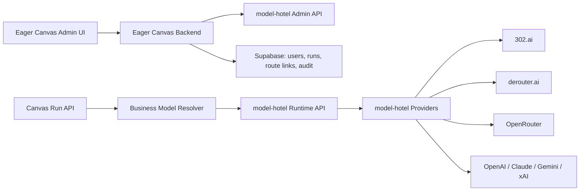

# Eager Canvas 多模型平台统一管理 PRD

> 文档状态：修订稿 / V1 PRD
> 核心修订：`model-hotel` 是统一聚合网关主体，302.ai、derouter.ai 等平台应接入 `model-hotel` 统一管理
> 编写日期：2026-05-27

---

## 1. 背景

Eager Canvas 当前后端的模型 API 基本直接指向 302.ai。现有代码已经包含 302 Dashboard API、用户服务开通、用户级 302 API key、官方用量记录同步、图片/视频异步任务查询等能力，但上游平台管理仍分散在 Eager Canvas 后端代码和环境变量中，无法在后台快速新增平台、切换模型路由和统一监控。

目标架构应以 `model-hotel` 作为统一模型聚合网关主体。302.ai、derouter.ai、OpenRouter、OpenAI、Gemini、Claude、xAI 等上游平台统一作为 `model-hotel providers` 接入，由 `model-hotel` 负责平台 key、模型发现、模型启停、虚拟 API key、请求日志、限流、failover 和健康状态。Eager Canvas 后端不再直接管理多平台 key 和路由，而是通过 `model-hotel` 的 Admin API 和 OpenAI-compatible runtime API 完成统一调用。

Eager Canvas 的职责是：

1. 保留画布业务编排、run 生命周期、媒体入库、用户体系、RBAC 和后台页面。
2. 通过后台代理 model-hotel Admin API，提供符合 Eager Canvas 权限体系的管理界面。
3. 将业务模型 key，例如 `image2`、`gpt-image-2`、`kling-o3`，映射到 model-hotel 中的 provider model 或 hotel failover group。
4. 在 model-hotel 现有能力不足时，推动 model-hotel 扩展 endpoint 和 provider adapter，而不是绕过 model-hotel 另起一套 provider 管理。

---

## 2. 总体结论

该需求可以实现，但需要把实现重点放在两条线上：

1. **Eager Canvas 接入 model-hotel 作为唯一模型网关**
   Eager Canvas 后端运行时调用 model-hotel，而不是直接调用 302.ai 或 derouter.ai。后台新增平台、用户虚拟 key、模型启停、日志和健康状态均通过 model-hotel 管理。

2. **扩展 model-hotel 支持图片/视频平台能力**
   model-hotel 当前核心代理能力集中在 `/v1/chat/completions` 和 `/v1/models`。如果 302.ai、derouter.ai 的图片/视频接口可以通过 OpenAI-compatible endpoint 暴露，则可以先配置为普通 provider；如果存在 302 专有路径，例如 `/ws/api/v3/...`、`/302/v2/video/create`、异步状态查询，则需要在 model-hotel 中新增 provider adapter 或 endpoint template 支持。

推荐路线：

1. V1 先让 Eager Canvas 的 chat 走 model-hotel。
2. V1.5 让 derouter.ai 这类 OpenAI-compatible 图片平台接入 model-hotel，并支持 `image2 -> derouter.ai`。
3. V2 扩展 model-hotel 支持 302.ai 图片/视频专有接口或通过兼容 shim 暴露成 model-hotel 可管理 provider。

---

## 3. 产品目标

### 3.1 后台平台管理

后台可以通过 Eager Canvas 管理界面快速添加 API 平台，但实际写入 model-hotel：

1. 添加 302.ai、derouter.ai、OpenRouter、OpenAI 等 provider。
2. 配置 provider base URL、API key、是否启用、是否自动发现模型。
3. 触发模型发现、模型测试、启用/禁用模型。
4. 查看 provider 健康状态、余额/配额、最近错误和请求日志。
5. 所有管理操作进入 Eager Canvas 审计日志，同时同步到 model-hotel。

### 3.2 模型路由管理

后台可以指定业务模块和业务模型走 model-hotel 中的某个 provider model 或 hotel failover group。

示例：

1. 图片模块 `image2` 使用 derouter.ai provider 下的 `image2`。
2. 聊天模块 `gpt-4o` 使用 model-hotel 自动生成的 `hotel/gpt-4o` failover group。
3. 图片模块 `gpt-image-2` 使用 302.ai provider 下的 `gpt-image-2`。

前端仍只传业务模型 key，例如：

```json
{
  "type": "image",
  "model": "image2",
  "payload": {
    "prompt": "..."
  }
}
```

Eager Canvas 后端解析业务模型 key 后，统一调用 model-hotel runtime endpoint。

### 3.3 用户 API 管理

用户 API 统一由 model-hotel 生成虚拟 key。

1. 管理员在 Eager Canvas 后台为用户开通服务。
2. Eager Canvas 后端调用 model-hotel `POST /api/virtual-keys`。
3. model-hotel 生成 `sk-...` 虚拟 key。
4. Eager Canvas 只保存 virtual key id、key preview、状态、限流配置和用户关系。
5. 运行时 Eager Canvas 使用用户对应的 model-hotel virtual key 调用 model-hotel。
6. 停用、重置、限流修改均通过 model-hotel virtual key API 完成。

---

## 4. 非目标

V1 不做以下事项：

1. 不继续在 Eager Canvas 新增独立的多 provider key 管理系统。
2. 不让 Eager Canvas 前端直接访问 model-hotel Admin API。
3. 不把 Eager Canvas 用户体系迁移进 model-hotel。
4. 不要求 V1 一次性覆盖所有 302.ai 视频专有接口。
5. 不做成本最优自动调度、A/B 实验、复杂竞价路由。

---

## 5. 从 model-hotel 获取的结构和功能

### 5.1 作为主系统直接使用的能力

model-hotel 已具备以下核心能力，应作为统一网关基础：

1. **Provider 管理**
   - `/api/providers`
   - provider name、base_url、encrypted_key、masked_key、enabled、autodiscovery_enabled
   - 可作为 302.ai、derouter.ai、OpenRouter 等平台的统一登记处

2. **模型管理**
   - `/api/models`
   - 模型启用/禁用、模型测试、模型 metadata、价格、能力、输入/输出 modality
   - Eager Canvas 的业务模型路由应指向 model-hotel model id 或 hotel group

3. **模型发现**
   - `/api/providers/{id}/discover`
   - `/api/providers/discover-all`
   - 对 OpenAI-compatible provider 可快速拉取模型
   - 对 302.ai/derouter.ai 若发现能力不足，应扩展 model-hotel discovery adapter

4. **虚拟 API key**
   - `/api/virtual-keys`
   - raw key 只返回一次
   - hash 存储、preview 展示、tokens_used、last_used_at、per-key rate limit
   - Eager Canvas 用户服务凭证应绑定 model-hotel virtual key

5. **请求代理**
   - `/v1/models`
   - `/v1/chat/completions`
   - 需要扩展 `/v1/images/generations`、`/v1/images/edits`、视频 submit/status 等 endpoint，或通过 compatibility provider 暴露

6. **日志和监控**
   - `/api/logs`
   - request_logs 记录 provider、model、status、latency、TTFT、token、virtual key、failover attempt
   - Eager Canvas 后台可以代理展示这些日志

7. **Failover**
   - model_failover_groups
   - hotel model，例如 `hotel/gpt-4o`
   - priority_order、entry_enabled、group_enabled、circuit breaker

### 5.2 需要在 model-hotel 扩展的能力

为满足 Eager Canvas 图片/视频业务，需要扩展 model-hotel，而不是在 Eager Canvas 绕开它：

1. **图片 endpoint**
   - `POST /v1/images/generations`
   - `POST /v1/images/edits`
   - 支持同步和异步响应归一化
   - 支持 image URL、base64、multipart form

2. **视频 endpoint**
   - `POST /v1/videos` 或 `POST /v1/video/generations`
   - `GET /v1/videos/{taskId}` 或 provider-specific status mapping
   - 支持 302.ai Kling、Veo、Seedance、Sora 等异步任务

3. **Provider capability schema**
   - provider 需要声明支持 `chat`、`image_generation`、`image_edit`、`video_generation`、`video_status`、`billing`、`quota`
   - model 需要声明 `input_modalities`、`output_modalities`、`async_mode`、`status_endpoint`

4. **Endpoint template / provider adapter**
   - 对 OpenAI-compatible 平台使用通用 adapter
   - 对 302.ai 专有接口使用 `302ai adapter`
   - 对 derouter.ai 如果不是完全兼容，则使用 `derouter adapter`

5. **非 token 用量**
   - image_count
   - video_seconds
   - task_id
   - official cost 或 estimated cost

---

## 6. Eager Canvas 的职责边界

Eager Canvas 不再作为多 provider 聚合网关，而是作为 model-hotel 的业务使用方和管理代理。

### 6.1 Eager Canvas 保留

1. 用户、登录、RBAC、后台入口。
2. 画布节点、workflow run、项目、媒体库。
3. 将前端业务模型 key 映射为 model-hotel runtime model。
4. 将 model-hotel 日志和用量映射回 Eager Canvas 用户与 run。
5. 对 model-hotel Admin API 做权限代理和审计。

### 6.2 Eager Canvas 不再负责

1. 不直接保存 302.ai、derouter.ai 等上游平台真实 API key。
2. 不直接做多 provider failover。
3. 不直接维护上游模型发现。
4. 不再新增独立 `302ai.adapter.js`、`derouter.adapter.js` 作为长期方案。

### 6.3 过渡期例外

当前 Eager Canvas 已有 302.ai 图片/视频直连逻辑。迁移期可以保留为 fallback，但必须标记为 legacy path。

要求：

1. 新平台优先接入 model-hotel。
2. 新模型路由优先走 model-hotel。
3. 只有 model-hotel 暂不支持的 302 专有视频/图片能力，才短期保留 Eager Canvas legacy direct path。
4. legacy path 需要在 V2 完成 model-hotel adapter 后下线。

---

## 7. 产品方案

### 7.1 后台 Provider 管理

新增后台菜单：`/admin/model-gateway/providers`

该页面实际代理 model-hotel provider API。

功能：

1. Provider 列表
   - provider name
   - provider type
   - base_url
   - masked_key
   - enabled
   - autodiscovery_enabled
   - last_discovered_at
   - last_used_at
   - model_count
   - health status

2. 添加 Provider
   - name：例如 `302ai`、`derouter`
   - base_url：例如 `https://api.302ai.cn`、`https://api.derouter.ai/v1`
   - api_key
   - provider_type，可选；若 model-hotel 当前只按 base_url 自动识别，则作为 Eager Canvas UI 辅助字段
   - capabilities，可选；需要 model-hotel 扩展后落库

3. 测试 Provider
   - 测试 base_url 可达性
   - 测试 `/v1/models`
   - 测试指定模型
   - 若支持，测试余额/配额

4. 模型发现
   - 点击后调用 model-hotel discovery
   - 对 derouter.ai：优先按 OpenAI-compatible `/v1/models`
   - 对 302.ai：如果 model-hotel 当前无法发现图片/视频模型，需要新增 302 discovery adapter 或手动导入模型

### 7.2 后台模型路由

新增后台菜单：`/admin/model-gateway/routes`

Eager Canvas 需要一张业务路由表，但这张表不保存上游平台 key，只保存业务模型到 model-hotel model id 的映射。

示例：

```json
{
  "module": "image",
  "businessModel": "image2",
  "gatewayModel": "derouter/image2",
  "runtimeEndpoint": "/v1/images/generations",
  "fallbackGatewayModels": ["302ai/image2"],
  "enabled": true,
  "timeoutMs": 180000
}
```

字段说明：

1. `module`：chat、image、image_edit、video。
2. `businessModel`：Eager Canvas 前端和 workflow 使用的模型 key。
3. `gatewayModel`：model-hotel 中的模型 id，例如 `derouter/image2` 或 `hotel/gpt-4o`。
4. `runtimeEndpoint`：调用 model-hotel 的 endpoint。
5. `fallbackGatewayModels`：业务层 fallback，可选；优先使用 model-hotel failover group。
6. `enabled`：是否启用。

优先级：

1. 如果 model-hotel 有 hotel failover group，优先使用 `hotel/<model>`。
2. 如果业务要求固定平台，例如 `image2` 固定 derouter.ai，则使用 `derouter/image2`。
3. 如果 model-hotel 不支持该 endpoint，才走 legacy direct path。

### 7.3 用户服务与虚拟 key

新增后台菜单：`/admin/model-gateway/user-keys`

流程：

1. 管理员为用户开通模型服务。
2. Eager Canvas 后端调用 model-hotel：

```http
POST /api/virtual-keys
Authorization: Bearer <model-hotel-admin-token>
```

```json
{
  "name": "eager_user_8f1c2a4b",
  "rate_limit_rps": 1,
  "rate_limit_burst": 5
}
```

3. model-hotel 返回：

```json
{
  "id": "virtual-key-id",
  "name": "eager_user_8f1c2a4b",
  "key": "sk-example-generated-once",
  "key_preview": "sk-...ce"
}
```

4. Eager Canvas 保存 virtual key link：
   - user_id
   - model_hotel_virtual_key_id
   - key_preview
   - status
   - rate_limit_rps
   - rate_limit_burst
   - created_by

5. 运行时所有模型调用均使用该用户的 model-hotel virtual key。
6. 禁用用户服务时，Eager Canvas 调用 model-hotel 删除或更新 virtual key。

---

## 8. 推荐技术架构



核心原则：

1. model-hotel 是唯一 provider 聚合网关。
2. 302.ai、derouter.ai 等都作为 model-hotel provider 接入。
3. Eager Canvas 后端只代理管理、解析业务模型、记录 run 和用户关系。
4. 新 provider 不应直接加到 Eager Canvas adapter。
5. model-hotel 能力不足时优先扩展 model-hotel。

---

## 9. 数据库设计

Eager Canvas 只保存业务映射、用户关系和审计，不复制 model-hotel 的 provider/model 全量数据。

新增 migration：`supabase/011_model_hotel_gateway_integration.sql`

### 9.1 `model_gateway_routes`

保存 Eager Canvas 业务模型到 model-hotel 模型的映射。

字段：

1. `id uuid primary key`
2. `module text not null`
3. `business_model text not null`
4. `gateway_model text not null`
5. `runtime_endpoint text not null`
6. `fallback_gateway_models jsonb not null default '[]'`
7. `timeout_ms integer not null default 180000`
8. `enabled boolean not null default true`
9. `legacy_direct_fallback boolean not null default false`
10. `created_by uuid`
11. `updated_by uuid`
12. `created_at timestamptz`
13. `updated_at timestamptz`

唯一约束：

```sql
unique(module, business_model)
```

### 9.2 `model_hotel_virtual_key_links`

保存 Eager Canvas 用户与 model-hotel virtual key 的关系。

字段：

1. `id uuid primary key`
2. `user_id uuid not null`
3. `model_hotel_virtual_key_id text not null`
4. `key_preview text not null`
5. `status text not null`
6. `rate_limit_rps numeric`
7. `rate_limit_burst integer`
8. `created_by uuid`
9. `created_at timestamptz`
10. `disabled_at timestamptz`
11. `last_error text`

### 9.3 `model_hotel_provider_cache`

可选缓存，用于后台列表提速，不作为真实来源。

字段：

1. `provider_id text primary key`
2. `name text`
3. `base_url text`
4. `enabled boolean`
5. `model_count integer`
6. `last_synced_at timestamptz`
7. `raw jsonb`

### 9.4 扩展 `usage_events`

新增：

1. `gateway_provider text`
2. `gateway_model text`
3. `gateway_virtual_key_id text`
4. `gateway_log_id text`
5. `billing_source text`

`billing_source` 可选值：

1. `model_hotel_log`
2. `provider_official`
3. `response_usage`
4. `estimated`
5. `legacy_302`

---

## 10. 后端模块设计

### 10.1 `backend/src/services/model-hotel-admin.service.js`

职责：

1. 调用 model-hotel Admin API。
2. Provider CRUD proxy。
3. Model list/test/discovery proxy。
4. Virtual key lifecycle。
5. Logs/stats proxy。

配置：

1. `MODEL_HOTEL_ADMIN_BASE_URL`
2. `MODEL_HOTEL_ADMIN_TOKEN`
3. `MODEL_HOTEL_RUNTIME_BASE_URL`
4. `MODEL_HOTEL_TIMEOUT_MS`

### 10.2 `backend/src/services/model-gateway-route.service.js`

职责：

1. 读取 `model_gateway_routes`。
2. 将 `{ type, model }` 解析为 `{ runtimeEndpoint, gatewayModel, timeoutMs }`。
3. 如果没有配置，按兼容默认值映射到 302 legacy 或 model-hotel 默认模型。
4. 提供 route test。

### 10.3 `backend/src/services/model-hotel-runtime.service.js`

职责：

1. 使用用户 virtual key 调用 model-hotel runtime API。
2. 支持 chat、image、video endpoint。
3. 将业务 payload 转换为 model-hotel runtime payload。
4. 归一化响应给现有 Eager Canvas 前端。

### 10.4 `backend/src/services/model-hotel-usage.service.js`

职责：

1. 按 virtual key、provider、model 拉取 model-hotel logs。
2. 将 model-hotel log 关联到 Eager Canvas run。
3. 写入或更新 `usage_events`。

---

## 11. model-hotel 需要调整的代码方向

### 11.1 Provider 管理

model-hotel 当前已经支持 provider CRUD，但 302.ai 和 derouter.ai 接入时需要确认：

1. 如果平台 OpenAI-compatible，只需配置 base_url 和 api_key。
2. 如果 host 不在 model-hotel allowlist，需要配置 `ALLOWED_PROVIDER_HOSTS` 或扩展内置 known provider hosts。
3. 如果需要自定义 provider type，需要扩展 provider detection。

### 11.2 图片支持

需要在 model-hotel 中增加：

1. runtime route：`POST /v1/images/generations`
2. runtime route：`POST /v1/images/edits`
3. provider capability：`image_generation`、`image_edit`
4. response normalization：URL、base64、task_id、status
5. request log 增加 image_count、task_id、cost 字段

### 11.3 视频支持

需要在 model-hotel 中增加：

1. runtime route：`POST /v1/videos` 或 `POST /v1/video/generations`
2. runtime route：`GET /v1/videos/{taskId}`
3. provider adapter：302.ai video、derouter video，如实际支持
4. request log 增加 video_seconds、task_id、state
5. 支持异步任务从 running 到 completed/failed 的日志更新

### 11.4 302.ai Dashboard 能力

如果希望 302.ai 的官方用量、余额、API key 管理也统一进入 model-hotel，需要在 model-hotel 中新增 302 Dashboard integration：

1. balance
2. api records
3. official cost
4. optional sub-key management

V1 可以先保留 Eager Canvas 读取 302 官方账单作为 reconciliation 补充，但 provider 调用和路由应优先走 model-hotel。

---

## 12. API 设计

### 12.1 Eager Canvas 后台代理 API

```http
GET /admin/model-gateway/providers
POST /admin/model-gateway/providers
GET /admin/model-gateway/providers/:id
PATCH /admin/model-gateway/providers/:id
DELETE /admin/model-gateway/providers/:id
POST /admin/model-gateway/providers/:id/discover
POST /admin/model-gateway/providers/:id/test
GET /admin/model-gateway/models
PATCH /admin/model-gateway/models/:id
POST /admin/model-gateway/models/:id/test
GET /admin/model-gateway/logs
```

这些接口代理 model-hotel，同时执行：

1. Eager Canvas authRequired。
2. RBAC permission check。
3. admin_operation_logs 审计。
4. 错误码归一化。

### 12.2 Eager Canvas 路由 API

```http
GET /admin/model-gateway/routes
POST /admin/model-gateway/routes
PATCH /admin/model-gateway/routes/:id
DELETE /admin/model-gateway/routes/:id
POST /admin/model-gateway/routes/:id/test
```

### 12.3 用户 virtual key API

```http
POST /admin/users/:userId/model-gateway-service/activate
PATCH /admin/users/:userId/model-gateway-service/limits
POST /admin/users/:userId/model-gateway-service/disable
POST /admin/users/:userId/model-gateway-service/reset
GET /admin/users/:userId/model-gateway-service
```

### 12.4 运行时 API

保持前端兼容：

```http
POST /runs/compat/chat/completions
POST /runs/compat/images/generations
POST /runs/compat/videos
GET /runs/compat/videos/:taskId
```

内部流程：

1. 创建 workflow run。
2. 查询用户 model-hotel virtual key。
3. 查询 `model_gateway_routes`。
4. 将业务模型替换为 `gateway_model`。
5. 调用 model-hotel runtime endpoint。
6. 保存结果、媒体、usage event。

---

## 13. 关键业务流程

### 13.1 添加 derouter.ai 并指定 image2

1. 管理员进入 `/admin/model-gateway/providers`。
2. 新增 provider：

```json
{
  "name": "derouter",
  "base_url": "https://api.derouter.ai/v1",
  "api_key": "sk-provider-key"
}
```

3. Eager Canvas 后端代理调用 model-hotel `POST /api/providers`。
4. 管理员触发 discover。
5. model-hotel 拉取 derouter.ai 模型。
6. 管理员进入 `/admin/model-gateway/routes`。
7. 新增 route：

```json
{
  "module": "image",
  "business_model": "image2",
  "gateway_model": "derouter/image2",
  "runtime_endpoint": "/v1/images/generations",
  "fallback_gateway_models": ["302ai/image2"],
  "enabled": true
}
```

8. 前端图片模块继续传 `model: "image2"`。
9. Eager Canvas 后端调用 model-hotel `/v1/images/generations`，请求体中的 `model` 为 `derouter/image2`。
10. model-hotel 负责向 derouter.ai 发起上游请求并记录日志。

### 13.2 添加 302.ai 到 model-hotel

1. 管理员新增 provider：

```json
{
  "name": "302ai",
  "base_url": "https://api.302ai.cn",
  "api_key": "sk-provider-key"
}
```

2. 如果 model-hotel 可通过 OpenAI-compatible `/v1/models` 发现模型，则直接 discover。
3. 如果图片/视频模型不在 `/v1/models` 中，则使用以下方案之一：
   - model-hotel 新增 302.ai discovery adapter。
   - 后台手动导入 302.ai 图片/视频模型到 model-hotel models。
   - 建一个 302 compatibility shim，将 302 专有能力包装成 model-hotel 可发现接口。

推荐顺序：先手动导入关键模型满足业务，再实现 302 discovery adapter。

### 13.3 用户服务开通

1. 管理员点击开通。
2. Eager Canvas 后端调用 model-hotel virtual key API。
3. model-hotel 创建 virtual key。
4. Eager Canvas 保存 key link。
5. 用户后续所有模型 run 都使用该 virtual key 调用 model-hotel。
6. model-hotel request_logs 可按 virtual key 回溯到 Eager Canvas 用户。

---

## 14. 里程碑

### Phase 0：model-hotel 主网关验证，1-2 天

交付：

1. 部署 model-hotel。
2. 配置 OpenAI-compatible provider。
3. 创建 virtual key。
4. Eager Canvas 后端使用 virtual key 调通 `/v1/chat/completions`。
5. 验证 derouter.ai 是否 OpenAI-compatible。
6. 验证 302.ai 在 model-hotel 中的最小可接入路径。

验收：

1. Eager Canvas chat 不再直接走 302 env provider。
2. model-hotel 日志能看到 virtual key、provider、model。
3. Eager Canvas 能把 model-hotel log 关联到用户。

### Phase 1：后台代理 model-hotel 管理能力，3-5 天

交付：

1. Eager Canvas 新增 model-hotel Admin API client。
2. 后台 provider/model/logs 页面代理 model-hotel。
3. 用户服务开通改为 model-hotel virtual key。
4. 审计日志覆盖 provider/key/model route 操作。

验收：

1. 管理员可在 Eager Canvas 后台新增 derouter.ai provider。
2. 管理员可发现或手动导入模型。
3. 管理员可创建、禁用、重置用户 virtual key。

### Phase 2：业务模型路由到 model-hotel，3-5 天

交付：

1. 新增 `model_gateway_routes`。
2. chat route 使用 model-hotel。
3. image route 支持 `image2 -> derouter/image2`。
4. runtime 调用从 Eager Canvas provider service 改为 model-hotel runtime service。

验收：

1. `image2` 能通过 model-hotel 调用 derouter.ai。
2. route 可在后台切换，无需发版。
3. 运行日志写入 model-hotel，并同步到 Eager Canvas usage。

### Phase 3：扩展 model-hotel 图片/视频 endpoint，5-10 天

交付：

1. model-hotel 支持 `/v1/images/generations`。
2. model-hotel 支持 `/v1/images/edits`。
3. model-hotel 支持视频 submit/status 最小闭环。
4. 302.ai 关键图片/视频模型接入 model-hotel。

验收：

1. 302.ai 图片生成可以通过 model-hotel 调用。
2. 302.ai 视频任务可以通过 model-hotel 创建和查询状态。
3. Eager Canvas legacy direct path 可以开始下线。

### Phase 4：用量、账单与监控统一，4-7 天

交付：

1. 同步 model-hotel request_logs 到 Eager Canvas usage。
2. 按 virtual key 映射 Eager Canvas user。
3. 302 官方账单作为 provider official reconciliation。
4. 后台展示 provider、model、user、run 维度用量。

验收：

1. 所有新 run 都有 gateway_model 和 gateway_virtual_key_id。
2. 管理员能按 provider 查看错误率和成本。
3. 302 official record 与 model-hotel log 可对账。

---

## 15. 收益

### 15.1 产品收益

1. API 平台统一在 model-hotel 管理，后台添加后即可使用。
2. 业务模型可快速切换 provider，例如 `image2` 从 302.ai 切到 derouter.ai。
3. 用户 API key 统一由 model-hotel 生成和限流。
4. 模型、provider、请求日志、failover 状态进入统一视图。

### 15.2 技术收益

1. Eager Canvas 后端不再继续堆 provider-specific 代码。
2. 多 provider failover、模型发现、key 加密、日志记录复用 model-hotel。
3. 新平台接入优先扩展 model-hotel，避免 Eager Canvas 与 model-hotel 两套网关分裂。
4. Eager Canvas 只维护业务模型映射和 run 编排，边界更清晰。

### 15.3 运维收益

1. 上游 provider 故障可在 model-hotel 中统一观察。
2. virtual key 可按用户限流和停用。
3. 请求日志和成本来源更容易追踪。
4. 降低单一 302.ai 依赖风险。

---

## 16. 风险与应对

### 16.1 model-hotel 当前 endpoint 范围不足

风险：model-hotel 当前主要支持 chat completions，图片/视频 endpoint 需要扩展。

应对：将图片/视频 endpoint 扩展列为 Phase 3 核心任务。Phase 2 只接入 derouter.ai 中已兼容的图片能力；302 视频专有能力短期保留 legacy direct path。

### 16.2 302.ai 专有 API 与 OpenAI-compatible 差异

风险：302.ai 的图片/视频、Dashboard record、异步任务状态不一定能直接通过 model-hotel 通用 OpenAI adapter 处理。

应对：在 model-hotel 中实现 302 provider adapter，包含 request mapping、response normalization、task status 和 official billing mapping。

### 16.3 Eager Canvas 与 model-hotel 数据一致性

风险：provider/model/virtual key 的真实状态在 model-hotel，Eager Canvas 只存映射，可能出现缓存过期。

应对：Eager Canvas 不复制 provider/model 为事实来源；后台页面实时代理 model-hotel；缓存表仅用于列表提速并带 `last_synced_at`。

### 16.4 用户 virtual key 泄露

风险：model-hotel 创建 key 时明文只返回一次，Eager Canvas 若保存明文会增加泄露面。

应对：Eager Canvas 不保存明文 key，只保存 virtual key id 和 preview。服务端运行时如果需要代表用户调用 model-hotel，应使用安全存储的 encrypted runtime key，或由 Eager Canvas 只保管一次性加密后的 key，具体实现需在实施计划中定稿。

### 16.5 管理权限越权

风险：model-hotel Admin API 权限很高，如果暴露给前端会绕过 Eager Canvas RBAC。

应对：前端永远不直接访问 model-hotel Admin API。所有操作经 Eager Canvas 后端代理，执行 `admin.model_gateway.*` 权限校验和审计。

### 16.6 迁移期间双路径并存

风险：Eager Canvas legacy 302 direct path 与 model-hotel path 并存，可能导致用量和账单重复或遗漏。

应对：usage_events 增加 `billing_source` 和 `gateway_log_id`。legacy path 标记为 `legacy_302`，model-hotel path 标记为 `model_hotel_log` 或 `provider_official`。

---

## 17. 权限设计

新增权限：

1. `admin.model_gateway.provider.read`
2. `admin.model_gateway.provider.manage`
3. `admin.model_gateway.model.read`
4. `admin.model_gateway.model.manage`
5. `admin.model_gateway.route.read`
6. `admin.model_gateway.route.manage`
7. `admin.model_gateway.virtual_key.manage`
8. `admin.model_gateway.logs.read`
9. `admin.model_gateway.health.read`

默认授权：

1. `super_admin`：全部权限。
2. `admin`：全部 model gateway 权限。
3. `ops`：read、test、logs、health 权限，不允许修改 provider key 和 route。
4. `support`：只允许查看用户服务状态，不允许管理 provider。

---

## 18. 验收标准

V1 完成时必须满足：

1. 302.ai 和 derouter.ai 都能作为 model-hotel provider 被管理或至少被登记。
2. Eager Canvas 后台新增 provider 实际写入 model-hotel。
3. Eager Canvas 后台可创建 model-hotel virtual key 并绑定用户。
4. Eager Canvas chat runtime 走 model-hotel。
5. `image2 -> derouter/image2` 可通过 model-hotel 路由执行，前提是 derouter.ai endpoint 兼容或 model-hotel 已扩展 image endpoint。
6. model-hotel request_logs 能按 virtual key、provider、model 查询。
7. Eager Canvas usage_events 能记录 gateway_model、gateway_virtual_key_id、gateway_log_id。
8. provider key 不在 Eager Canvas API 响应中明文返回。
9. model-hotel Admin API 不暴露给前端。
10. legacy 302 direct path 被标记并有下线计划。

---

## 19. 推荐结论

推荐采用“model-hotel 作为统一聚合网关主体，Eager Canvas 作为业务编排和后台代理”的架构。

理由：

1. 这与“统一管理各个平台接口、随时添加和监控”的目标一致。
2. 302.ai、derouter.ai 等平台都应进入 model-hotel provider 管理，而不是在 Eager Canvas 中分别做 adapter。
3. 用户 API key 由 model-hotel virtual key 统一生成和限流，后台管理口径更干净。
4. Eager Canvas 只保留业务模型映射、用户关联、run 编排和媒体资产处理，避免成为第二套网关。
5. 当前最大工作量不是 Eager Canvas 多写几个 adapter，而是扩展 model-hotel 支持图片/视频和 302 专有接口；这条路线长期收益更高。
